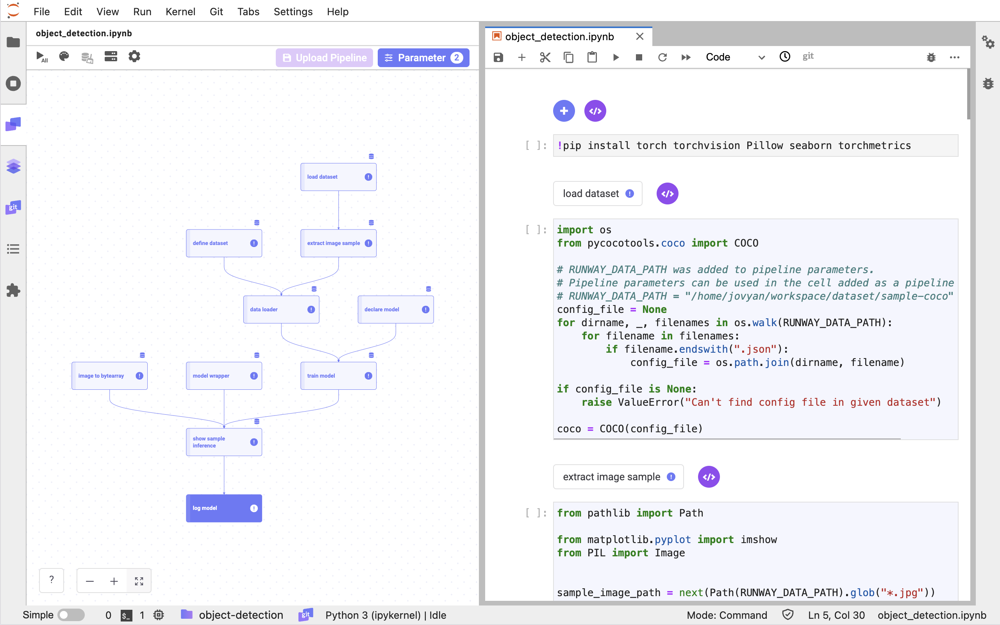
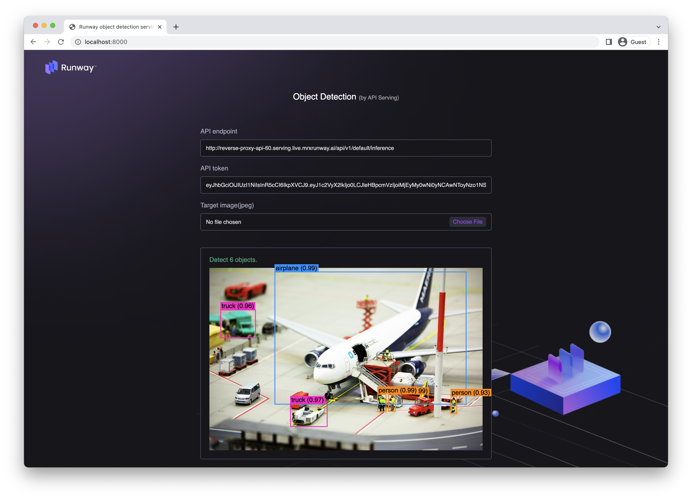

# Object Detection

We use the Link included in Runway to train and save the image model.
To utilize the written model training code for retraining, we construct and save a pipeline.

> 📘 For quick execution, you can use the Jupyter Notebook provided below.
> If you download and run the Jupyter Notebook, a model named "my-detection-model" will be created and saved in Runway.
>
> **[object detection notebook](https://drive.google.com/uc?export=download&id=1WgdswAqXZtRE-BMJXpiFIBYHV-oboV4F)**



## Runway

### Dataset Creation

#### Connect Data source

1. Go to Project Settings and select Data source.
2. Click on `Connect Data source` to connect a new data source.
3. Choose AWS S3 for storage.
4. Enter the received ID and key values.


5. Confirm the connection and create the data source.

#### Upload Metadata

> 📘 Currently, Runway only supports COCO-format config.
>
> You can download the available config for the received data source by clicking on the items below.
> **[Image Metadata](https://docs.google.com/uc?export=download&id=1wTgUpmV9KM36dfjH_4U52AdaIZ_3gV9a)**

1. Go to the Runway project menu and navigate to the dataset page.
2. Create a new dataset on the dataset page.
3. Click on the "Create Dataset" button in the top right corner.
4. Select `Storage` on `Image Data` area.
5. Provide a name and description for the dataset you are creating.
6. Choose the file to include in the dataset using the file explorer or drag-and-drop.
7. Click on `Create`.

## Link

### Package Preparation

1. Install the required packages for the tutorial.
   ```python
   !pip install torch torchvision Pillow seaborn
   ```

### Data

#### Load Data

> 📘 You can find detailed instructions on how to load the dataset in the [Import Dataset](https://docs.mrxrunway.ai/v0.13.0-Eng/docs/import-dataset).

1. Use the Runway code snippet menu to import the list of datasets registered in your project.
2. Select the created dataset and assign it to a variable.
3. Register the code with the Link component.

#### Extract a sample image

1. Extract a sample data and check the image.

   ```python
   from pathlib import Path
   from matplotlib.pyplot import imshow
   from PIL import Image


   sample_image_path = Path(RUNWAY_DATA_PATH).parent / "000000000139.jpg"
   image_filename_list = [sample_image_path]

   img = Image.open(sample_image_path)
   imshow(img)
   ```

   

### Training

#### COCO Dataset

1. To train the model, create a Dataset provided by PyTorch.

   ```python
   from PIL import Image
   from pathlib import Path
   from pycocotools.coco import COCO
   import torch
   from torch.utils.data import Dataset
   from torchvision import transforms as T


   def get_transforms():
       transforms = []
       transforms.append(T.ToTensor())
       return T.Compose(transforms)


   def collate_fn(batch):
       return tuple(zip(*batch))


   class COCODataset(Dataset):
       def __init__(self, data_root, coco, transforms=None):
           self.data_root = Path(data_root)
           self.transforms = transforms
           # pre-loaded variables
           self.coco = coco
           self.ids = list(sorted(self.coco.imgs.keys()))

       def __getitem__(self, index):
           ## refer to https://pytorch.org/tutorials/intermediate/torchvision_tutorial.html
           img_id = self.ids[index]
           ann_ids = self.coco.getAnnIds(imgIds=img_id)
           ann = self.coco.loadAnns(ann_ids)
           img_path = self.data_root / self.coco.loadImgs(img_id)[0]["file_name"]
           img = Image.open(img_path)
           num_objs = len(ann)

           boxes = []
           for i in range(num_objs):
               boxes.append([
                   ann[i]["bbox"][0],
                   ann[i]["bbox"][1],
                   ann[i]["bbox"][2] + ann[i]["bbox"][0],
                   ann[i]["bbox"][3] + ann[i]["bbox"][1],
               ])

           areas = []
           for i in range(num_objs):
               areas.append(ann[i]["area"])

           target = {
               "boxes": torch.as_tensor(boxes, dtype=torch.float32),
               "labels": torch.ones((num_objs,), dtype=torch.int64),
               "image_id": torch.tensor([img_id]),
               "area": torch.as_tensor(areas, dtype=torch.float32),
               "iscrowd": torch.zeros((num_objs,), dtype=torch.int64),
           }

           ## transform image
           if self.transforms is not None:
               img = self.transforms(img)

           return img, target

       def __len__(self):
           return len(self.ids)
   ```

2. Use the declared data to create a data loader.

   ```python
   from torch.utils.data import DataLoader

   ## Define Train dataset
   data_root = Path(RUNWAY_DATA_PATH).parent
   dataset = COCODataset(data_root, coco, get_transforms())

   data_loader = DataLoader(
       dataset,
       batch_size=2,
       shuffle=True,
       num_workers=4,
       collate_fn=collate_fn
   )
   ```

### Model Declaration

1. Declare the model to be used for training. In this tutorial, we use the `fasterrcnn_resnet50_fpn` model from PyTorch.

   ```python
   import torch
   from torchvision.models.detection import fasterrcnn_resnet50_fpn

   ## Define local variables
   print(torch.cuda.is_available())
   device = torch.device("cuda") if torch.cuda.is_available() else torch.device("cpu")

   ## Define training model
   model = fasterrcnn_resnet50_fpn(weights="DEFAULT").to(device)
   ```

### Model Training

> 📘 You can find guidance on registering Link parameters in the **[Set Pipeline Parameter](https://docs.mrxrunway.ai/v0.13.0-Eng/docs/set-pipeline-parameter)**.

1. Set the number of epochs for model training by registering 1 in the `N_EPOCHS` Link parameter.
2. Train the declared model using the data loader created above.

   ```python
   import torch.optim as optim


   params = [p for p in model.parameters() if p.requires_grad]
   optimizer = optim.SGD(params, lr=1e-5)

   model.train()
   for epoch in range(N_EPOCHS):
       for imgs, annotations in data_loader:
           imgs = list(img.to(device) for img in imgs)
           annotations = [{k: v.to(device) for k, v in t.items()} for t in annotations]
           loss_dict = model(imgs, annotations)
           losses = sum(loss for loss in loss_dict.values())

           optimizer.zero_grad()
           losses.backward()
           optimizer.step()

   model.eval()
   torch.cuda.empty_cache()
   ```

### Model Inference

#### Model Wrapping Class Declaration

1. Create a ModelWrapper to serve the trained model.

   ```python
   import io
   import base64

   import torch
   import pandas as pd
   import numpy as np
   from torchvision import transforms
   from PIL import Image


   class ModelWrapper:
       def __init__(self, model, device):
           self.model = model
           self.device = device

       def bytesarray_to_tensor(self, bytes_array: str):
           ## input : "utf-8" decoded bytes_array
           encoded_bytes_array = bytes_array.encode("utf-8")
           ## decode encoded_bytes_array with ascii code
           img_64_decode = base64.b64decode(encoded_bytes_array)
           ## get image file and transform to tensor
           image_from_bytes = Image.open(io.BytesIO(img_64_decode))
           return transforms.ToTensor()(image_from_bytes).to(self.device)

       def tensor_to_bytesarray(self, tensor: torch.Tensor):
           tensor_bytes_array = tensor.detach().cpu().numpy().tobytes()
           tensor_64_encode = base64.b64encode(tensor_bytes_array)
           bytes_array = tensor_64_encode.decode("utf-8")
           return bytes_array

       @torch.no_grad()
       def predict(self, df):
           self.model.eval()
           ## df is 1-d dataframe with bytes array
           tensor_list = list((map(self.bytesarray_to_tensor, df.squeeze(axis=1).to_list())))
           pred = self.model(tensor_list)
           result = pd.DataFrame(pred).applymap(lambda x: self.tensor_to_bytesarray(x))
           torch.cuda.empty_cache()
           return result

       def revert_predict_to_array(self, pred):
           pred_decode = pred.applymap(base64.b64decode)
           for key in pred_decode.keys():
               if key == "labels":
                   pred_decode[key] = pred_decode[key].apply(lambda x: np.frombuffer(x, dtype=int))
               elif key == "boxes":
                   pred_decode[key] = pred_decode[key].apply(lambda x: np.frombuffer(x, dtype=np.float32).reshape(-1, 4))
               else:
                   pred_decode[key] = pred_decode[key].apply(lambda x: np.frombuffer(x, dtype=np.float32))
           return pred_decode
   ```

2. Wrap the trained model with ModelWrapper.

   ```python
   serve_model = ModelWrapper(model=model, device=device)
   ```

#### Sample Image Inference

1. Currently, Runway only supports Dataframe format for input and output in API serving. To do this, write code to convert the input images to bytearrays.

   ```python
   import base64
   import pandas as pd


   def convert_image_to_bytearray(img_binary):
       image_64_encode = base64.b64encode(img_binary)
       bytes_array = image_64_encode.decode("utf-8")
       return bytes_array


   def images_to_bytearray_df(image_filename_list: list):
       df_list = []
       for img_filename in image_filename_list:
           #image = open(img_filename, "rb")  # open binary file in read mode
           image_read = image.read()
           df_list.append(convert_image_to_bytearray(image_read))
       return pd.DataFrame(df_list, columns=["image_data"])
   ```

2. Create an `input_sample` using the data and conversion code above, and perform inference using the wrapped model.

   ```python
   from PIL import ImageDraw
   import seaborn as sns

   ## make input sample
   input_sample = images_to_bytearray_df(image_filename_list)

   ## For inference
   pred = serve_model.predict(input_sample)
   predictions = serve_model.revert_predict_to_array(pred)

   ## Load Categories
   cats = dataset.coco.loadCats(dataset.coco.getCatIds())
   cats_palette = sns.color_palette("Set2", len(cats)).as_hex()
   for idx in range(len(cats)):
       cats[idx]["color"] = cats_palette[idx]

   ## Draw inference results
   img = Image.open(sample_image_path)
   for idx in range(len(predictions["boxes"][0])):
       label = predictions["labels"][0][idx]
       score = predictions["scores"][0][idx]
       box = predictions["boxes"][0][idx]
       ## cat = cats[label]
       cat = dataset.coco.loadCats(label.item())[0]

       if score < 0.9:
           continue

       draw = ImageDraw.Draw(img)
       draw.rectangle(box, outline=cat["color"], width = 3)
       draw.text(box, cat["name"], cat["color"])

   imshow(img)
   del draw
   ```

3. Check the inference results.  
   

### Model Saving

> 📘 You can find detailed instructions on how to save the model in the [Upload Model](https://docs.mrxrunway.ai/v0.13.0-Eng/docs/upload-model).

1. Generate the code to save the model using the save model option from the Runway code snippet.

   ```python Python
   import runway

   runway.log_model(model_name="my-detection-model", model=serve_model, input_samples={"predict": input_sample})
   ```

## Pipeline Configuration and Saving

> 📘 For specific guidance on creating a pipeline, refer to the [Create Pipeline](https://docs.mrxrunway.ai/v0.13.0-Eng/docs/create-pipeline).

1. Select the code cells to be included in the pipeline and configure them as components.
2. Once the pipeline is complete, run the entire pipeline to verify that it works correctly.
3. After confirming the pipeline's successful operation, save the pipeline in Runway.
   1. Click on "Upload Pipeline" in the left panel area.
   2. Choose the pipeline saving option:
      1. For new pipeline, select "New Pipeline."
      2. For updating an existing pipeline, select "Update Version"
   3. Provide the necessary information to save the pipeline.
4. Go back to Runway project page, and click Pipeline.
5. You can now access the saved pipeline in the Runway project menu under the Pipeline page.

## Model Deployment

> 📘 You can find specific guidance on model deployment in the **[Model Deployment](https://docs.mrxrunway.ai/v0.13.0-Eng/docs/model-deployments)**.

## Demo Service

1. To test the deployed model, you can use the following [demo website](http://demo.service.mrxrunway.ai/object).
2. If you are in demo site you will see the following screen:

   

3. Fill in the API Endpoint, API Token, and upload the image for prediction:

   

4. You will receive the result:

   
