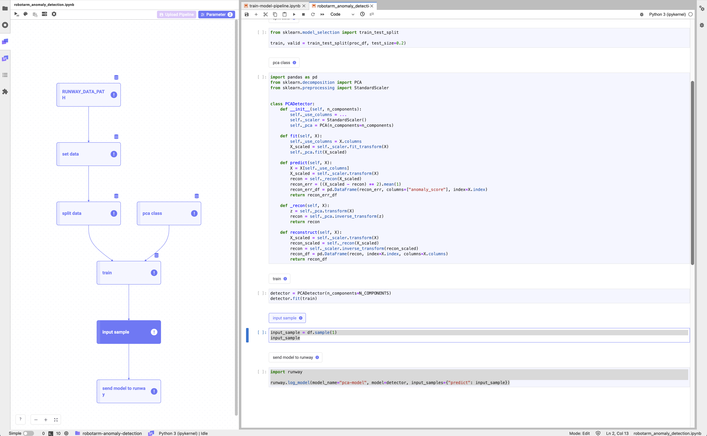

# Robotarm Anomaly Detection

We use the Link included in Runway to load a table-formatted dataset and train a regression model, which will then be saved. We also set up and save a pipeline to reuse the written model training code for future retraining.

> 📘 For quick execution, you can utilize the following Jupyter Notebook.  
> If you download and execute the Jupyter Notebook below, a model named "pca-model" will be created and saved in Runway.
> 
> **[robotarm anomaly detection notebook](https://drive.google.com/uc?export=download&id=10d2Hc4lYx0WOuEvLOkqNTQMpDezbzVzw)**




## Runway

### Create dataset

> 📘 This tutorial creates a model for anomaly detection using data simulated to mimic a 4-axis robot arm.
>
> You can download the robot arm dataset by clicking the link below.
> **[robotarm-train.csv](https://drive.google.com/uc?export=download&id=1Ks8SUVBQawiKW0q0zQT1sc9um618cdEE)**

1. Go to the Runway project menu and navigate to the dataset page.
2. Create a new dataset on the dataset page.
3. Click on the `Create Dataset` button in the top right corner.
4. Select `Local File`.
5. Provide a name and description for the dataset you are creating.
6. Choose the file to include in the dataset using the file explorer or drag-and-drop.
7. Click on `Create`.


## Link

### Package Preparation

1. (Optional) Install the required packages for the tutorial.
    ```python
    !pip install pandas scikit-learn
    ```

### Data

#### Load Data

> 📘 You can find detailed instructions on how to load the dataset in the [Import Dataset](https://docs.mrxrunway.ai/v0.13.0-Eng/docs/import-dataset).

1. Use the Runway code snippet menu to import the list of datasets registered in your project.
2. Select the created dataset and assign it to a variable.
3. Register the code with the Link component.

    ```python
    import os
    import pandas as pd

    dfs = []
    for dirname, _, filenames in os.walk(RUNWAY_DATA_PATH):
        for filename in filenames:
            dfs += [pd.read_csv(os.path.join(dirname, filename))]
    df = pd.concat(dfs)
    ```

#### Data Preprocessing

1. Set the index in the dataset and remove the "id" values, then use only a total of 1000 data points.

    ```python
    proc_df = raw_df.set_index("datetime").drop(columns=["id"]).tail(1000)
    ```

2. Split the dataset into training and testing sets.

    ```python
    from sklearn.model_selection import train_test_split

    train, valid = train_test_split(proc_df, test_size=0.2)
    ```

### Model

#### Model Class

1. Write a model class for model training.

    ```python
    import pandas as pd
    from sklearn.decomposition import PCA
    from sklearn.preprocessing import StandardScaler


    class PCADetector:
        def __init__(self, n_components):
            self._use_columns = ...
            self._scaler = StandardScaler()
            self._pca = PCA(n_components=n_components)
        
        def fit(self, X):
            self._use_columns = X.columns
            X_scaled = self._scaler.fit_transform(X)
            self._pca.fit(X_scaled)
        
        def predict(self, X):
            X = X[self._use_columns]
            X_scaled = self._scaler.transform(X)
            recon = self._recon(X_scaled)
            recon_err = ((X_scaled - recon) ** 2).mean(1)
            recon_err_df = pd.DataFrame(recon_err, columns=["anomaly_score"], index=X.index)
            return recon_err_df
        
        def _recon(self, X):
            z = self._pca.transform(X)
            recon = self._pca.inverse_transform(z)
            return recon

        def reconstruct(self, X):
            X_scaled = self._scaler.transform(X)
            recon_scaled = self._recon(X_scaled)
            recon = self._scaler.inverse_transform(recon_scaled)
            recon_df = pd.DataFrame(recon, index=X.index, columns=X.columns)
            return recon_df
    ```

### Model Training

> 📘 You can find guidance on registering Link parameters in the **[Set Pipeline Parameter](https://docs.mrxrunway.ai/v0.13.0-Eng/docs/set-pipeline-parameter)**.

1. To specify the number of components to use in PCA, register 2 in the N_COMPONENTS Link parameter.

     

2. Use the Link parameter into the declared model class, and perform model training using the training dataset and evaluate model.

    ```python
    
    parameters = {"n_components": N_COMPONENTS}

    detector = PCADetector(n_components=parameters["n_components"])
    detector.fit(train)

    train_pred = detector.predict(train)
    valid_pred = detector.predict(valid)

    mean_train_recon_err = train_pred.mean()
    mean_valid_recon_err = valid_pred.mean()
    ```

### Model Saving

> 📘 You can find detailed instructions on how to save the model in the [Upload Model](https://docs.mrxrunway.ai/v0.13.0-Eng/docs/upload-model).

1. Create a sample input data from the training dataset.

    ```python
    input_sample = proc_df.sample(1)
    input_sample
    ```
2. Use the "save model" option from the Runway code snippet to save the model. And also save model related information.

    ```python
    import runway

    # start run
    runway.start_run()

    # log model related info
    runway.log_parameters(parameters)
    runway.log_metric("mean_train_recon_err", mean_train_recon_err)
    runway.log_metric("mean_valid_recon_err", mean_valid_recon_err)

    # log model
    runway.log_model(model_name="pca-model", model=detector, input_samples={"predict": input_sample})
    ```


## Pipeline Configuration and Saving

> 📘 For specific guidance on creating a pipeline, refer to the [Create Pipeline](https://docs.mrxrunway.ai/v0.13.0-Eng/docs/create-pipeline).

1. Select the code cells to be included in the pipeline and configure them as components.
2. Once the pipeline is complete, run the entire pipeline to verify that it works correctly.
3. After confirming the pipeline's successful operation, save the pipeline in Runway.
    1. Click on "Upload Pipeline" in the left panel area.
    2. Choose the pipeline saving option:
        1. For new pipeline, select "New Pipeline."
        2. For updating an existing pipeline, select "Update Version"
    3. Provide the necessary information to save the pipeline.
4. Go back to Runway project page, and click Pipeline.
5. You can now access the saved pipeline in the Runway project menu under the Pipeline page.
