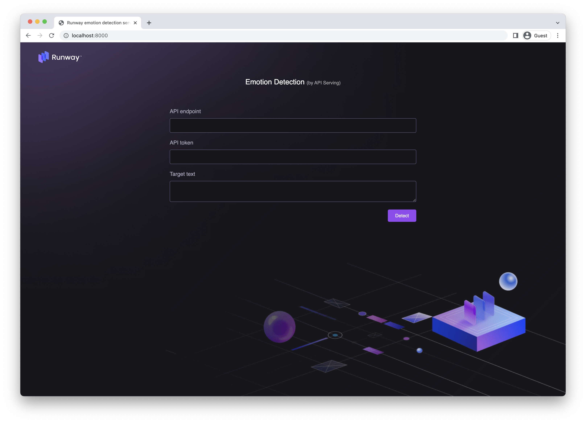

# Sentiment Classification with Huggingface

We use the Link included in Runway to train and save a Huggingface model.  
We also set up and save a pipeline to reuse the written model training code for future retraining.

> 📘 For quick execution, you can utilize the following Jupyter Notebook.  
> If you download and execute the Jupyter Notebook below, a model named "my-text-model" will be created and saved in Runway.
>
> **[sentiment classification with huggingface](https://drive.google.com/uc?export=download&id=1lbONDH69PuaJXrlxed3P6UlCfLAWaoqo)**


## Runway

### 데이터셋 생성

> 📘 This tutorial uses the IMDB dataset provided by Stanford University, which has been reprocessed and uploaded as part of the [huggingface dataset](https://huggingface.co/datasets/imdb/tree/refs%2Fconvert%2Fparquet/plain_text). With this dataset, you can perform sentiment analysis.
>
> You can download the imdb dataset by clicking the link below.
> **[IMDB test dataset](https://drive.google.com/uc?export=download&id=1QlIzPfOw_b0xXnXM6rxnW3Vbr-VDm0At)**

1. Go to the Runway project menu and navigate to the dataset page.
2. Create a new dataset on the dataset page.
3. Click on the `Create Dataset` button in the top right corner.
4. Select `Local File` on `Tabular Data` area.
5. Provide a name and description for the dataset you are creating.
6. Choose the file to include in the dataset using the file explorer or drag-and-drop.
7. Click on `Create`.

## Link

### Package Preparation

1. Install the required packages for the tutorial.

   ```python
   !pip install transformers[torch] datasets evaluate
   ```

### Data

#### Load Data

> 📘 You can find detailed instructions on how to load the dataset in the [Import Dataset](https://docs.mrxrunway.ai/v0.13.0-Eng/docs/import-dataset).

1. Use the Runway code snippet menu to import the list of datasets registered in your project.
2. Select the created dataset and assign it to a variable.
3. Register the code with the Link component.

   ```python
   import pandas as pd

   df = pd.read_parquet(RUNWAY_DATA_PATH)
   ```

4. Create Huggingface Dataset with Pandas dataframe.

   ```python
   from datasets import Dataset

   ds = Dataset.from_pandas(df.sample(1000))
   ds.set_format("pt")
   ```

#### Data Preprocessing

> 📘 You can find guidance on registering Link parameters in the **[Set Pipeline Parameter](https://docs.mrxrunway.ai/v0.13.0-Eng/docs/set-pipeline-parameter)**.

1. To choose the architecture for the tokenizer, register "distilbert-base-uncased" in the MODEL_ARCH_NAME Link parameter.

   

2. Load the tokenizer and write the preprocessing code.

   ```python
   from transformers import AutoTokenizer, DataCollatorWithPadding


   tokenizer = AutoTokenizer.from_pretrained(MODEL_ARCH_NAME)
   data_collator = DataCollatorWithPadding(tokenizer=tokenizer)


   def preprocess_function(examples):
       return tokenizer(examples["text"], truncation=True)
   ```

3. Perform data preprocessing.

   ```python
   tokenized_ds = ds.map(preprocess_function, batch_size=True)
   ```

### Model Training

1. Use the Transformer's `AutoModelForSequenceClassification` module to load the model.

   ```python
   import torch
   from transformers import AutoModelForSequenceClassification

   device = "cuda" if torch.cuda.is_available() else "cpu"
   id2label = {0: "NEGATIVE", 1: "POSITIVE"}
   label2id = {"NEGATIVE": 0, "POSITIVE": 1}
   model = AutoModelForSequenceClassification.from_pretrained(
       MODEL_ARCH_NAME, num_labels=2, id2label=id2label, label2id=label2id
   ).to(device)
   ```

2. Use the loaded model and the training dataset to perform model training.

   ```python
   from transformers import TrainingArguments, Trainer


   training_args = TrainingArguments(
       output_dir="tmp",
       learning_rate=2e-5,
       per_device_train_batch_size=4,
       num_train_epochs=1,
       weight_decay=0.01,
   )

   trainer = Trainer(
       model=model,
       args=training_args,
       train_dataset=tokenized_ds,
       tokenizer=tokenizer,
       data_collator=data_collator,
   )

   trainer.train()
   ```

### Model Saving

#### Model Wrapping Class

1. Write the HuggingModel class to be used for API serving.

   ```python
   import pandas as pd


   class HuggingModel:
       def __init__(self, pipeline):
           self.pipeline = pipeline

       def predict(self, X):
           result = self.pipeline(X["text"].to_list())
           return pd.DataFrame.from_dict(result)
   ```

2. Create the Transformer pipeline and wrap it with the HuggingModel.

   ```python
   from transformers import pipeline


   model = model.to("cpu")
   pipe = pipeline("text-classification", model=model, tokenizer=tokenizer)

   hug_model = HuggingModel(pipe)
   ```

#### Model Saving

> 📘 You can find detailed instructions on how to save the model in the [Upload Model](https://docs.mrxrunway.ai/v0.13.0-Eng/docs/upload-model).

1. Create a sample input data from the training dataset.

   ```python
   input_sample = df.sample(1).drop(columns=["label"])
   input_samples
   ```

   ```

   ```

2. Use the "save model" option from the Runway code snippet to save the model.

   ```python
   import runway

   runway.log_model(model_name="my-text-model", model=hug_model, input_samples={"predict": input_sample})
   ```

## Pipeline Configuration and Saving

> 📘 For specific guidance on creating a pipeline, refer to the [Create Pipeline](https://docs.mrxrunway.ai/v0.13.0-Eng/docs/create-pipeline).

1. Select the code cells to be included in the pipeline and configure them as components.
2. Once the pipeline is complete, run the entire pipeline to verify that it works correctly.
3. After confirming the pipeline's successful operation, save the pipeline in Runway.
   1. Click on "Upload Pipeline" in the left panel area.
   2. Choose the pipeline saving option:
      1. For new pipeline, select "New Pipeline."
      2. For updating an existing pipeline, select "Update Version"
   3. Provide the necessary information to save the pipeline.
4. Go back to Runway project page, and click Pipeline.
5. You can now access the saved pipeline in the Runway project menu under the Pipeline page.

## Model Deployment

> 📘 You can find specific guidance on model deployment in the **[Model Deployment](https://docs.mrxrunway.ai/v0.13.0-Eng/docs/model-deployments)**.

## Demo Site

1. To test the deployed model, you can use the following [demo website](http://demo.service.mrxrunway.ai/emotion).
2. If you are in demo site you will see the following screen:

   

3. Input the API Endpoint, API Token received, and the sentence to predict.

   

4. You will receive the result.

   
