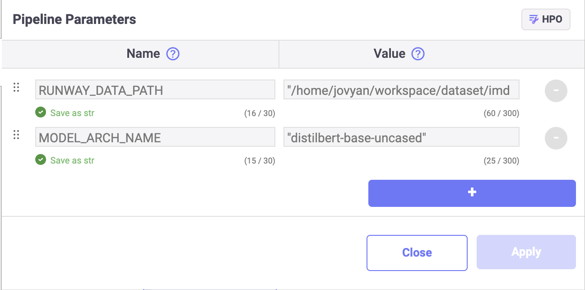

# Sentiment Classification with Huggingface

Runway에 포함된 Link를 사용하여 Huggingface 모델을 학습하고 저장합니다.  
작성한 모델 학습 코드를 재학습에 활용하기 위해 파이프라인을 구성하고 저장합니다.

> 📘 빠른 실행을 위해 아래의 주피터 노트북을 활용할 수 있습니다.  
> 아래의 주피터 노트북을 다운로드 받아 실행할 경우, "my-text-model" 이름의 모델이 생성되어 Runway에 저장됩니다.  
> 
> **[sentiment classification with huggingface](https://drive.google.com/uc?export=download&id=1lbONDH69PuaJXrlxed3P6UlCfLAWaoqo)**


# Runway

## 데이터셋 생성

> 📘 이 튜토리얼은 Stansford 에서 제공하는 imdb 데이터셋을 재가공해 업로드한 [huggingface 의 데이터 셋](https://huggingface.co/datasets/imdb/tree/refs%2Fconvert%2Fparquet/plain_text)입니다. 해당 데이터셋을 이용해 감성 분석을 진행할 수 있습니다.
>
> IMDB 데이터셋은 아래 항목을 클릭하여 다운로드할 수 있습니다.  
> **[IMDB test dataset](https://drive.google.com/uc?export=download&id=1QlIzPfOw_b0xXnXM6rxnW3Vbr-VDm0At)**

1. Runway 프로젝트 메뉴에서 데이터셋 페이지로 이동합니다.
2. 데이터셋 페이지에서 신규 데이터셋을 생성합니다.
3. 데이터셋 페이지의 우측 상단 `Create Dataset`을 클릭합니다.
4. Tabular Data 영역의 Local file을 클릭합니다.
5. 저장하는 데이터셋의 이름과 설명을 입력합니다.
6. 데이터셋으로 생성할 파일을 파일 탐색기로 선택하거나, Drag&Drop으로 입력합니다.
7. `Create`를 클릭합니다.

# Link

## 패키지 설치

1. 튜토리얼에서 사용할 패키지를 설치합니다.

```Text Python
!pip install transformers[torch] datasets evaluate
```

## 데이터

### 데이터 불러오기

> 📘 데이터 세트 불러오는 방법에 대한 구체적인 가이드는 **[데이터 세트 가져오기](https://docs.mrxrunway.ai/docs/데이터-세트-가져오기)** 가이드 에서 확인할 수 있습니다.

1. Runway 코드 스니펫 메뉴의 **import dataset**을 이용해 프로젝트에 등록되어 있는 데이터셋 목록을 불러옵니다.
2. 생성한 데이터셋을 선택하고 variable 이름을 적습니다.
3. 코드를 생성하고 Link 컴포넌트로 등록합니다.

    ```python
    import pandas as pd

    df = pd.read_parquet(RUNWAY_DATA_PATH)
    ```
4. Pandas 데이터 프레임으로 Huggingface Dataset 을 생성합니다.

    ```python
    from datasets import Dataset

    ds = Dataset.from_pandas(df.sample(1000))
    ds.set_format("pt")
    ```

### 데이터 전처리

> 📘 Link 파라미터 등록 가이드는 **[파이프라인 파라미터 설정](https://dash.readme.com/project/makinarocks-runway/docs/파이프라인-파라미터-설정)** 문서에서 확인할 수 있습니다.

1. 토크나이저로 사용할 아키텍쳐를 정하기 위해서 Link 파라미터로 MODEL_ARCH_NAME 에 "distilbert-base-uncased" 를 등록합니다.

    

2. 토크나이저를 불러오고 전처리 코드를 작성합니다.

    ```python
    from transformers import AutoTokenizer, DataCollatorWithPadding


    tokenizer = AutoTokenizer.from_pretrained(MODEL_ARCH_NAME)
    data_collator = DataCollatorWithPadding(tokenizer=tokenizer)


    def preprocess_function(examples):
        return tokenizer(examples["text"], truncation=True)
    ```

3. 데이터에 전처리를 수행합니다.

    ```python
    tokenized_ds = ds.map(preprocess_function, batch_size=True)
    ```

## 모델 학습

1. Transformer 의 `AutoModelForSequenceClassification` 모듈을 이용해 모델을 불러옵니다.

    ```python
    import torch
    from transformers import AutoModelForSequenceClassification

    device = "cuda" if torch.cuda.is_available() else "cpu"
    id2label = {0: "NEGATIVE", 1: "POSITIVE"}
    label2id = {"NEGATIVE": 0, "POSITIVE": 1}
    model = AutoModelForSequenceClassification.from_pretrained(
        MODEL_ARCH_NAME, num_labels=2, id2label=id2label, label2id=label2id
    ).to(device)
    ```
2. 불러온 모델과 학습용 데이터셋을 활용하여, 모델 학습을 수행합니다.

    ```python
    from transformers import TrainingArguments, Trainer


    training_args = TrainingArguments(
        output_dir="tmp",
        learning_rate=2e-5,
        per_device_train_batch_size=4,
        num_train_epochs=1,
        weight_decay=0.01,
    )

    trainer = Trainer(
        model=model,
        args=training_args,
        train_dataset=tokenized_ds,
        tokenizer=tokenizer,
        data_collator=data_collator,
    )

    trainer.train()
    ```

## 모델 저장
### 모델 랩핑 클래스

1. API 서빙에 이용할 수 있도록 HuggingModel 클래스를 작성합니다.

    ```python
    import pandas as pd


    class HuggingModel:
        def __init__(self, pipeline):
            self.pipeline = pipeline
        
        def predict(self, X):
            result = self.pipeline(X["text"].to_list())
            return pd.DataFrame.from_dict(result)
    ```
2. Transformer 파이프라인을 생성하고 HuggingModel 로 랩핑합니다.

    ```python
    from transformers import pipeline


    model = model.to("cpu")
    pipe = pipeline("text-classification", model=model, tokenizer=tokenizer)

    hug_model = HuggingModel(pipe)

### 모델 저장

> 📘  모델 저장 방법에 대한 구체적인 가이드는 **[모델 저장](https://docs.mrxrunway.ai/docs/%EB%AA%A8%EB%8D%B8-%EC%A0%80%EC%9E%A5)** 문서에서 확인할 수 있습니다.

1. 모델 학습에 사용한 학습 데이터의 샘플을 생성합니다.

    ```python
    input_sample = df.sample(1).drop(columns=["label"])
    input_samples
    ```

    ```
2. Runway code snippet 의 save model을 사용해 모델을 저장하는 코드를 생성합니다.

    ```python
    import runway

    runway.log_model(model_name="my-text-model", model=hug_model, input_samples={"predict": input_sample})
    ```

# 파이프라인 구성 및 저장

> 📘 파이프라인 생성 방법에 대한 구체적인 가이드는 **[파이프라인 생성](https://docs.mrxrunway.ai/docs/파이프라인-생성)** 문서에서 확인할 수 있습니다.

1. 파이프라인으로 구성할 코드 셀을 선택하여 컴포넌트로 설정합니다.
2. 파이프라인으로 구성이 완료되면, 전체 파이프라인을 실행하여 정상 동작 여부를 확인합니다.
3. 파이프라인의 정상 동작 확인 후, 파이프라인을 Runway에 저장합니다.
    1. 좌측 패널 영역의 Upload Pipeline을 클릭합니다.
    2. Pipeline 저장 옵션을 선택합니다.
        1. 신규 저장의 경우, New Pipeline을 선택합니다.
        2. 기존 파이프라인의 업데이트일 경우, Version Update를 선택합니다.
    3. 파이프라인 저장을 위한 값을 입력 후, Save를 클릭합니다.
4. Runway 프로젝트 메뉴에서 Pipeline 페이지로 이동합니다.
5. 저장한 파이프라인의 이름을 클릭하면 파이프라인 상세 페이지로 진입합니다. 
