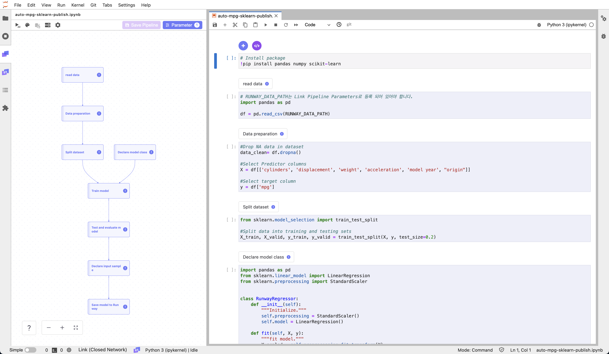

# 자동차 연비 예측 (Auto MPG Regression)

<h4 align="center">
    <p>
        <b>한국어</b> |
        <a href="README_en.md">English</a>
    <p>
</h4>

<h3 align="center">
    <p>The MLOps platform to Let your AI run</p>
</h3>

## 소개

이 튜토리얼은 UC Irvine에서 제공하는 자동차의 정보가 포함된 AutoMPG 데이터 세트를 사용하여 회귀 모델을 학습하고 저장합니다. 작성한 모델 학습 코드를 재학습에 활용하기 위해 파이프라인을 구성하고 저장합니다.

> 📘 빠른 실행을 위해 아래의 주피터 노트북을 활용할 수 있습니다.  
> 아래의 주피터 노트북을 다운로드 받아 실행할 경우, "auto-mpg-reg-model-sklearn" 이름의 모델이 생성되어 Runway에 저장됩니다.
>
> **[auto mpg model notebook](https://drive.google.com/uc?export=download&id=1v2L3OeycGqgqcc8w2ost9SPX730sVcwg)**



### 패키지 설치

1. (Optional) 튜토리얼에서 사용할 패키지를 설치합니다.
    ```python
    !pip install sklearn pandas numpy
    ```

## 데이터
Runway 튜토리얼 폴더에 포함된 CSV 파일을 불러와 데이터 세트를 생성하고, 전처리합니다.

> 📘 튜토리얼에 사용할 데이터는 1970년대 후반과 1980년대 초반에 출시된 자동차의 정보가 포함된 AutoMPG 데이터입니다. 개별 자동차의 실린더 수, 배기량, 마력, 공차 중량, 제조국 등의 특성이 포함되어있습니다.
> AutoMPG 데이터 세트는 `./dataset` 경로에 위치하고 있으며, 필요할 경우 아래 링크를 통해 데이터를 다운로드할 수 있습니다. 
>  **[auto-mpg.csv](https://runway-tutorial.s3.ap-northeast-2.amazonaws.com/auto-mpg.csv)**

### 데이터 불러오기

1. 파일 탐색기에서 데이터 세트 파일의 경로를 확인합니다.
2. RUNWAY_DATA_PATH 파라미터에 데이터 파일의 경로를 할당합니다.
    
    ```python
    import os
    import pandas as pd

    RUNWAY_DATA_PATH = "/home/jovyan/workspace/examples/tutorial/auto_mpg_regression/dataset"

    dfs = []
    for dirname, _, filenames in os.walk(RUNWAY_DATA_PATH):
        for filename in filenames:
            if filename.endswith(".csv"):
                d = pd.read_csv(os.path.join(dirname, filename))
            elif filename.endswith(".parquet"):
                d = pd.read_parquet(os.path.join(dirname, filename))
            else:
                raise ValueError("Not valid file type")
            dfs += [d]
    df = pd.concat(dfs)
    ```

### 데이터 전처리

1. 데이터 세트에 포함된 결측치 값을 제거하고, 학습 특성 데이터 세트와 목표 특성 데이터 세트를 분리합니다.
    ```python
    # Drop NA data in dataset
    data_clean = df.dropna()

    # Select Predictor columns
    X = df[["cylinders", "displacement", "weight", "acceleration", "origin"]]

    # Select target column
    y = df["mpg"]
    ```

2. 데이터 세트를 학습용 데이터 세트와 테스트용 데이터 세트로 분리합니다.

    ```python
    from sklearn.model_selection import train_test_split

    ## Split data into training and testing sets
    X_train, X_valid, y_train, y_valid = train_test_split(X, y, test_size=0.2, random_state=2024)
    ```

## 모델

### 모델 클래스

1. 모델 학습을 위한 모델 클래스를 작성합니다.

    ```python
    import pandas as pd
    from sklearn.linear_model import LinearRegression
    from sklearn.preprocessing import StandardScaler


    class RunwayRegressor:
        def __init__(self):
            """Initialize."""
            self.preprocessing = StandardScaler()
            self.model = LinearRegression()

        def fit(self, X, y):
            """fit model."""
            X_scaled = self.preprocessing.fit_transform(X)
            self.model.fit(X_scaled, y)

        def predict(self, X):
            X_scaled = self.preprocessing.transform(X)
            pred = self.model.predict(X_scaled)
            pred_df = pd.DataFrame({"mpg_pred": pred})
            return pred_df
    ```

### 모델 학습

1. 선언한 모델 클래스와 학습용 데이터 세트를 활용하여, 모델의 학습과 관련 정보를 로깅합니다.
    ```python
    from sklearn.metrics import mean_squared_error


    runway_regressor = RunwayRegressor()
    runway_regressor.fit(X_train, y_train)

    #Test model on held out test set
    valid_pred = runway_regressor.predict(X_valid)

    #Mean Squared error on the testing set
    mse = mean_squared_error(valid_pred, y_valid)

    #Print evaluate model score
    print("Mean Squared Error: {}".format(mse))
    ```

### 모델 등록
학습이 완료된 회귀 모델을 Runway에 등록하여 추론 서비스에서 사용할 수 있도록 합니다.

1. Runway 플랫폼의 모델 등록 코드 스니펫을 사용하여, 학습이 완료된 모델을 등록(`log_model`)하고 관련 정보를 기록합니다.

    ``` python
    import mlflow
    import runway

    with mlflow.start_run():
        mlflow.log_metric("mse", mse)

        runway.log_model(
            model=runway_regressor,
            input_samples={"predict": X_train.sample(1)},
            model_name="auto-mpg-reg-model-sklearn",
        )
    ```

## 파이프라인 구성 및 저장

> 📘 파이프라인 생성 방법에 대한 구체적인 가이드는 **[파이프라인 구성](https://docs.live.mrxrunway.ai/guide/core-features/dev-instances/create-a-pipeline/)** 문서에서 확인할 수 있습니다.

1. **Link**에서 파이프라인을 작성하고 정상 실행 여부를 확인합니다.
2. 정상 실행 확인 후, Link pipeline 패널의 **Upload pipeline** 버튼을 클릭합니다.
3. **New Pipeline** 버튼을 클릭합니다.
4. **Pipeline** 필드에 Runway에 저장할 이름을 작성합니다.
5. **Pipeline version** 필드에는 자동으로 버전 1이 선택됩니다.
6. **Upload** 버튼을 클릭합니다.
7. 업로드가 완료되면 프로젝트 내 Pipeline 페이지에 업로드한 파이프라인 항목이 표시됩니다.

