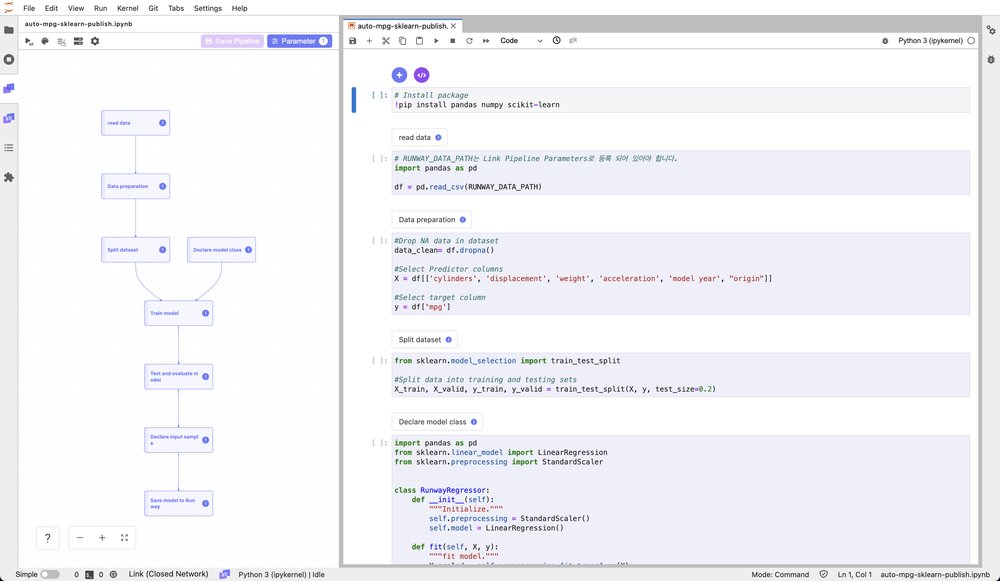

# Auto MPG Regression

<h4 align="center">
    <p>
        <b>한국어</b> |
        <a href="README_en.md">English</a>
    <p>
</h4>

<h3 align="center">
    <p>The MLOps platform to Let your AI run</p>
</h3>

## Introduction

Runway에 포함된 Link를 사용하여 테이블 형식 데이터 세트를 로드하고 회귀 모델을 학습하여 저장합니다. 작성한 모델 학습 코드를 재학습에 활용하기 위해 파이프라인을 구성하고 저장합니다.

> 📘 빠른 실행을 위해 아래의 주피터 노트북을 활용할 수 있습니다.  
> 아래의 주피터 노트북을 다운로드 받아 실행할 경우, "auto-mpg-reg-model-sklearn" 이름의 모델이 생성되어 Runway에 저장됩니다.
>
> **[auto mpg model notebook](https://drive.google.com/uc?export=download&id=1v2L3OeycGqgqcc8w2ost9SPX730sVcwg)**



## Runway

### 데이터셋 생성

> 📘 이 튜토리얼은 UC Irvine에서 제공하는 1970년대 후반과 1980년대 초반에 출시된 자동차의 정보가 포함된 AutoMPG 데이터 세트를 사용합니다.  
> 해당 데이터 세트에는 개별 자동차의 실린더 수, 배기량, 마력, 공차 중량, 제조국 등의 특성이 포함되어있습니다.
>
> AutoMPG 데이터셋은 아래 항목을 클릭하여 다운로드할 수 있습니다.  
> **[auto-mpg.csv](https://runway-tutorial.s3.ap-northeast-2.amazonaws.com/auto-mpg.csv)**

1. Runway 프로젝트 메뉴에서 데이터셋 페이지로 이동합니다.
2. 데이터셋 페이지에서 신규 데이터셋을 생성합니다.
3. 데이터셋 페이지의 우측 상단 `Create Dataset`을 클릭합니다.
4. Local file을 클릭합니다.
5. 저장하는 데이터셋의 이름과 설명을 입력합니다.
6. 데이터셋으로 생성할 파일을 파일 탐색기로 선택하거나, Drag&Drop으로 입력합니다.
7. `Create`를 클릭합니다.

## Link

### 패키지 준비

1. (Optional) 튜토리얼에서 사용할 패키지를 설치합니다.
   ```python
   !pip install sklearn pandas numpy
   ```

### 데이터

#### 데이터 불러오기

> 📘 데이터 세트 불러오는 방법에 대한 구체적인 가이드는 **[데이터 세트 가져오기](https://docs.mrxrunway.ai/docs/데이터-세트-가져오기)** 가이드 에서 확인할 수 있습니다.

1. Runway 코드 스니펫 메뉴의 **import dataset**을 이용해 프로젝트에 등록되어 있는 데이터셋 목록을 불러옵니다.
2. 생성한 데이터셋을 선택하고 variable 이름을 적습니다.
3. 코드를 생성하고 Link 컴포넌트로 등록합니다.

   ```python
   import os
   import pandas as pd

   dfs = []
   for dirname, _, filenames in os.walk(RUNWAY_DATA_PATH):
       for filename in filenames:
           dfs += [pd.read_csv(os.path.join(dirname, filename))]
   df = pd.concat(dfs)
   ```

#### 데이터 전처리

1. 데이터 세트에 포함된 결측치 값을 제거하고, 학습 특성 데이터 세트와 목표 특성 데이터 세트를 분리합니다.

   ```python
   ## Drop NA data in dataset
   data_clean= df.dropna()

   ## Select Predictor columns
   X = df[['cylinders', 'displacement', 'weight', 'acceleration', "origin"]]

   ## Select target column
   y = df['mpg']
   ```

2. 데이터셋을 학습용 데이터셋과 테스트용 데이터셋으로 분리합니다.

   ```python
   from sklearn.model_selection import train_test_split

   ## Split data into training and testing sets
   X_train, X_valid, y_train, y_valid = train_test_split(X, y, test_size=0.2)
   ```

### 모델

#### 모델 클래스

1. 모델 학습을 위한 모델 클래스를 작성합니다.

   ```python
   import pandas as pd
   from sklearn.linear_model import LinearRegression
   from sklearn.preprocessing import StandardScaler


   class RunwayRegressor:
       def __init__(self):
           """Initialize."""
           self.preprocessing = StandardScaler()
           self.model = LinearRegression()

       def fit(self, X, y):
           """fit model."""
           X_scaled = self.preprocessing.fit_transform(X)
           self.model.fit(X_scaled, y)

       def predict(self, X):
           X_scaled = self.preprocessing.transform(X)
           pred = self.model.predict(X_scaled)
           pred_df = pd.DataFrame({"mpg_pred": pred})
           return pred_df
   ```

#### 모델 학습

1. 선언한 모델 클래스와 학습용 데이터셋을 활용하여, 모델 학습을 수행합니다.

   ```python
   runway_regressor = RunwayRegressor()
   runway_regressor.fit(X_train, y_train)
   ```

2. 학습한 모델의 성능을 확인합니다.

   ```python
   from sklearn.metrics import mean_squared_error

   ## Test model on held out test set
   valid_pred = runway_regressor.predict(X_valid)

   ## Mean Squared error on the testing set
   mse = mean_squared_error(valid_pred, y_valid)

   ## Print evaluate model score
   print('Mean Squared Error: {}'.format(mse))
   ```

### 모델 저장

> 📘 모델 저장 방법에 대한 구체적인 가이드는 **[모델 저장](https://dash.readme.com/project/makinarocks-runway/docs/모델-저장)** 문서에서 확인할 수 있습니다.

1. 모델 학습에 사용한 학습 데이터의 샘플을 생성합니다.

   ```python
   input_samples = X_train.sample(1)
   input_samples
   ```

2. Runway code snippet 의 save model을 사용해 모델을 저장하는 코드를 생성합니다.

   ```python
    import runway

    runway.log_metric("mse", mse)
    runway.log_model(model_name='auto-mpg-reg-model-sklearn', model=runway_regressor, input_samples={'predict': input_samples})
   ```

## 파이프라인 구성 및 저장

> 📘 파이프라인 생성 방법에 대한 구체적인 가이드는 **[파이프라인 생성](https://docs.mrxrunway.ai/docs/파이프라인-생성)** 문서에서 확인할 수 있습니다.

1. 파이프라인으로 구성할 코드 셀을 선택하여 컴포넌트로 설정합니다.
2. 파이프라인으로 구성이 완료되면, 전체 파이프라인을 실행하여 정상 동작 여부를 확인합니다.
3. 파이프라인의 정상 동작 확인 후, 파이프라인을 Runway에 저장합니다.
   1. 좌측 패널 영역의 Upload Pipeline을 클릭합니다.
   2. Pipeline 저장 옵션을 선택합니다.
      1. 신규 저장의 경우, New Pipeline을 선택합니다.
      2. 기존 파이프라인의 업데이트일 경우, Version Update를 선택합니다.
   3. 파이프라인 저장을 위한 값을 입력 후, Save를 클릭합니다.
4. Runway 프로젝트 메뉴에서 Pipeline 페이지로 이동합니다.
5. 저장한 파이프라인의 이름을 클릭하면 파이프라인 상세 페이지로 진입합니다.
