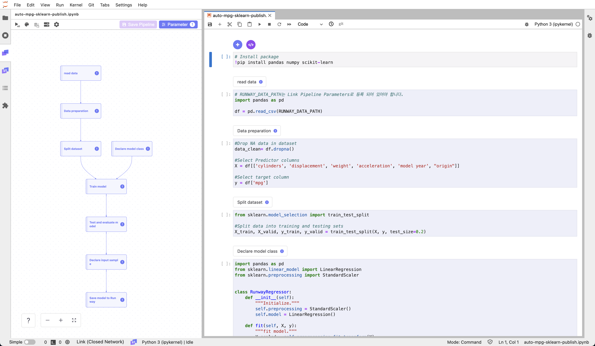

# Auto MPG Regression

<h4 align="center">
    <p>
        <a href="README.md">한국어</a> |
        <b>English</b>
    <p>
</h4>

<h3 align="center">
    <p>The MLOps platform to Let your AI run</p>
</h3>

## Introduction

In this tutorial, we will perform tabular regression on the AutoMPG dataset using a runway pipeline. The goal is to load the tabular data, train a regression model, and then save it for future use.

> 📘 For quick execution, you can use the Jupyter Notebook provided below.
> If you download and run the Jupyter Notebook, a model named "auto-mpg-reg-model-sklearn" will be created and saved in Runway.
>
> **[auto mpg model notebook](https://drive.google.com/uc?export=download&id=1v2L3OeycGqgqcc8w2ost9SPX730sVcwg)**



## Runway

### Create dataset

> We will use the AutoMPG dataset, which contains information about cars released in the late 1970s and early 1980s, including attributes such as the number of cylinders, displacement, horsepower, weight, and origin.
>
> You can download the AutoMPG dataset using the following link:  
> **[auto-mpg.csv](https://runway-tutorial.s3.ap-northeast-2.amazonaws.com/auto-mpg.csv)**

1. Go to the Runway project menu and navigate to the dataset page.
2. Create a new dataset on the dataset page.
3. Click on the `Create Dataset` button in the top right corner.
4. Select `Local File`.
5. Provide a name and description for the dataset you are creating.
6. Choose the file to include in the dataset using the file explorer or drag-and-drop.
7. Click on `Create`.

## Link

### Package Preparation

1. (Optional) Install the required packages for the tutorial.
   ```python
   !pip install sklearn pandas numpy
   ```

### Data

#### Load Data

> 📘 You can find detailed instructions on how to load the dataset in the [Import Dataset](https://docs.mrxrunway.ai/v0.13.0-Eng/docs/import-dataset).

1. Use the Runway code snippet menu to import the list of datasets registered in your project.
2. Select the created dataset and assign it to a variable.
3. Register the code with the Link component.

   ```python
   import os
   import pandas as pd

   dfs = []
   for dirname, _, filenames in os.walk(RUNWAY_DATA_PATH):
       for filename in filenames:
           dfs += [pd.read_csv(os.path.join(dirname, filename))]
   df = pd.concat(dfs)
   ```

#### Data Preprocessing

1. Remove any missing values in the dataset and separate the predictor and target columns.

   ```python
   ## Drop NA data in dataset
   data_clean= df.dropna()

   ## Select Predictor columns
   X = df[['cylinders', 'displacement', 'weight', 'acceleration', "origin"]]

   ## Select target column
   y = df['mpg']
   ```

2. Split the dataset into training and testing sets.

   ```python
   from sklearn.model_selection import train_test_split

   #Split data into training and testing sets
   X_train, X_valid, y_train, y_valid = train_test_split(X, y, test_size=0.2)
   ```

#### Model

##### Model Class

1. Define a model class for training the regression model.

   ```python
   import pandas as pd
   from sklearn.linear_model import LinearRegression
   from sklearn.preprocessing import StandardScaler


   class RunwayRegressor:
       def __init__(self):
           """Initialize."""
           self.preprocessing = StandardScaler()
           self.model = LinearRegression()

       def fit(self, X, y):
           """fit model."""
           X_scaled = self.preprocessing.fit_transform(X)
           self.model.fit(X_scaled, y)

       def predict(self, X):
           X_scaled = self.preprocessing.transform(X)
           pred = self.model.predict(X_scaled)
           pred_df = pd.DataFrame({"mpg_pred": pred})
           return pred_df
   ```

#### Model Training

1. Use the declared model class and the training dataset to train the model.

   ```python
   runway_regressor = RunwayRegressor()
   runway_regressor.fit(X_train, y_train)
   ```

2. Evaluate the model's performance.

   ```python
   from sklearn.metrics import mean_squared_error

   #Test model on held out test set
   valid_pred = runway_regressor.predict(X_valid)

   #Mean Squared error on the testing set
   mse = mean_squared_error(valid_pred, y_valid)

   #Print evaluate model score
   print('Mean Squared Error: {}'.format(mse))
   ```

### Model Saving

> 📘 You can find detailed instructions on how to save the model in the [Upload Model](https://docs.mrxrunway.ai/v0.13.0-Eng/docs/upload-model).

1. Create a sample input data from the training dataset.

   ```python
   input_samples = X_train.sample(1)
   input_samples
   ```

2. Use the "save model" option from the Runway code snippet to save the model.

   ```python
    import runway

    runway.log_metric("mse", mse)
    runway.log_model(model_name='auto-mpg-reg-model-sklearn', model=runway_regressor, input_samples={'predict': input_samples})
   ```

## Pipeline Configuration and Saving

> 📘 For specific guidance on creating a pipeline, refer to the [Create Pipeline](https://docs.mrxrunway.ai/v0.13.0-Eng/docs/create-pipeline).

1. Select the code cells to be included in the pipeline and configure them as components.
2. Once the pipeline is complete, run the entire pipeline to verify that it works correctly.
3. After confirming the pipeline's successful operation, save the pipeline in Runway.
   1. Click on "Upload Pipeline" in the left panel area.
   2. Choose the pipeline saving option:
      1. For new pipeline, select "New Pipeline."
      2. For updating an existing pipeline, select "Update Version"
   3. Provide the necessary information to save the pipeline.
4. Go back to Runway project page, and click Pipeline.
5. You can now access the saved pipeline in the Runway project menu under the Pipeline page.
