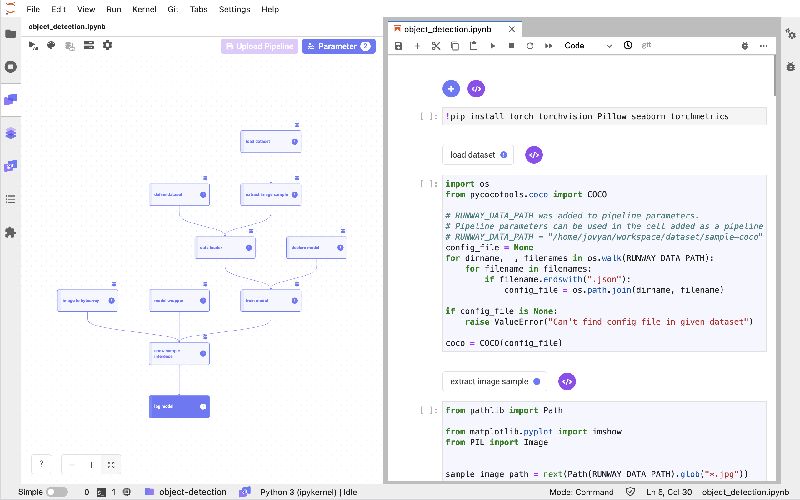
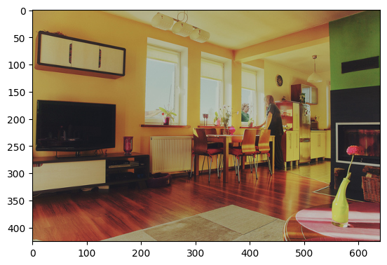
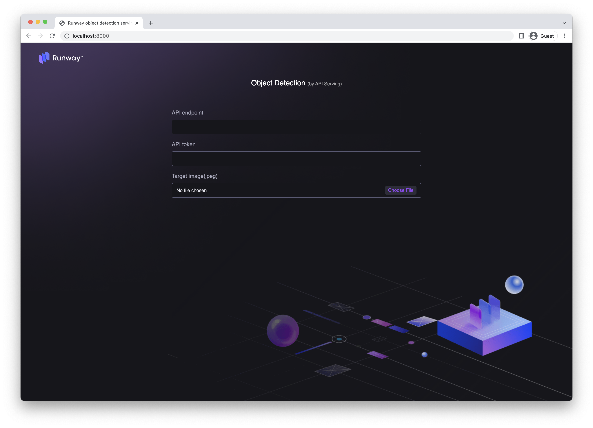
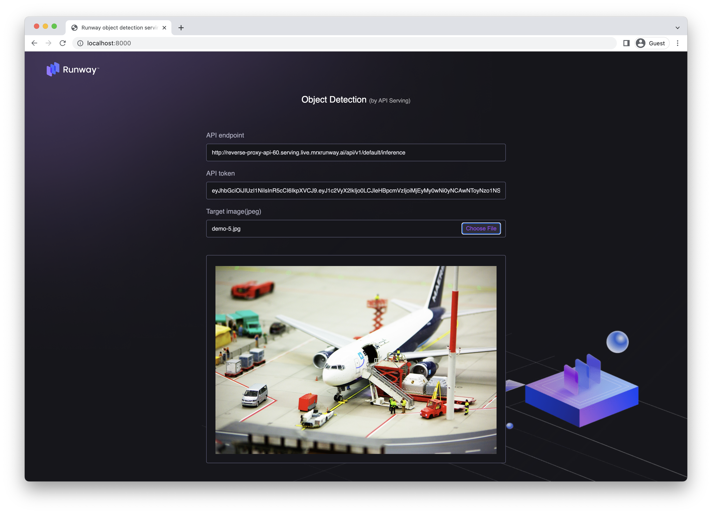
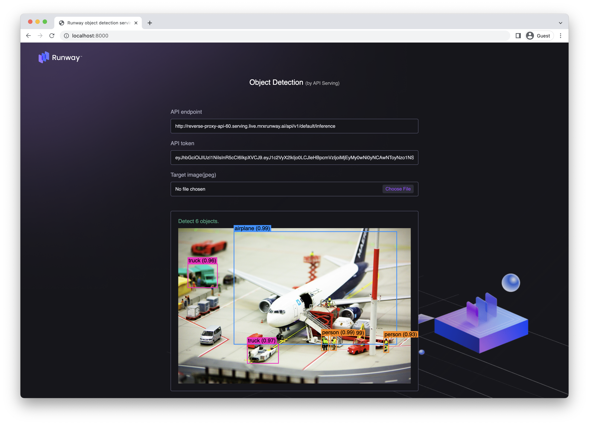

# Object Detection

<h4 align="center">
    <p>
        <b>한국어</b> |
        <a href="README_en.md">English</a>
    <p>
</h4>

<h3 align="center">
    <p>The MLOps platform to Let your AI run</p>
</h3>

## Introduction

Runway에 포함된 Link를 사용하여 이미지 모델을 학습하고 저장합니다.  
작성한 모델 학습 코드를 재학습에 활용하기 위해 파이프라인을 구성하고 저장합니다.

> 📘 빠른 실행을 위해 아래의 주피터 노트북을 활용할 수 있습니다.  
> 아래의 주피터 노트북을 다운로드 받아 실행할 경우, "my-detection-model" 이름의 모델이 생성되어 Runway에 저장됩니다.
>
> **[object detection notebook](https://drive.google.com/uc?export=download&id=1WgdswAqXZtRE-BMJXpiFIBYHV-oboV4F)**



## Runway

### 데이터셋 생성

> 📘 이 튜토리얼은 COCO 데이터 셋의 일부를 사용해 객체 탐지를 수행하는 모델을 생성합니다.
>
> COCO 샘플 데이터셋은 아래 항목을 클릭하여 다운로드 할 수 있습니다.  
> **[coco-sample-dataset.zip](https://drive.google.com/uc?export=download&id=1TrM3y8aRRmaYnIlDI902p73Lsw0XC89B)**

1. Runway 프로젝트 메뉴에서 데이터셋 페이지로 이동합니다.
2. 데이터셋 페이지에서 신규 데이터셋을 생성합니다.
3. 데이터셋 페이지의 우측 상단 `Create Dataset`을 클릭합니다.
4. 저장하는 데이터셋의 이름과 설명을 입력합니다.
5. 다운로드 받은 파일의 압축을 해제합니다.
6. 데이터셋으로 생성할 파일들(jpg, json)을 파일 탐색기로 선택하거나, Drag&Drop으로 입력합니다.
7. `Create`를 클릭합니다.

## Link

### 패키지 설치

1. 튜토리얼에서 사용할 패키지를 설치합니다.
    ```python
    !pip install torch torchvision Pillow seaborn torchmetrics
    ```

### 데이터

#### 데이터 불러오기

> 📘 데이터 세트 불러오는 방법에 대한 구체적인 가이드는 **[데이터 세트 가져오기](https://docs.mrxrunway.ai/docs/데이터-세트-가져오기)** 가이드 에서 확인할 수 있습니다.

1. Runway 코드 스니펫 메뉴의 **import dataset**을 이용해 프로젝트에 등록되어 있는 데이터셋 목록을 불러옵니다.
2. 생성한 데이터셋을 선택해서 코드를 생성합니다.

    ```python
    import os
    from pycocotools.coco import COCO

    # RUNWAY_DATA_PATH was added to pipeline parameters.
    # Pipeline parameters can be used in the cell added as a pipeline component.
    # RUNWAY_DATA_PATH = "/home/jovyan/workspace/dataset/sample-coco"
    config_file = None
    for dirname, _, filenames in os.walk(RUNWAY_DATA_PATH):
        for filename in filenames:
            if filename.endswith(".json"):
                config_file = os.path.join(dirname, filename)

    if config_file is None:
        raise ValueError("Can't find config file in given dataset")

    coco = COCO(config_file)
    ```

#### 예제 데이터 추출

1. 샘플 데이터 하나를 추출 후 이미지를 확인합니다.

    ```python
    from pathlib import Path
    from matplotlib.pyplot import imshow
    from PIL import Image


    sample_image_path = Path(RUNWAY_DATA_PATH).parent / "000000000139.jpg"
    image_filename_list = [sample_image_path]

    img = Image.open(sample_image_path)
    imshow(img)
    ```

    

### 학습

#### COCO 데이터셋

1. 모델을 학습하기 위해서 pytorch 에서 제공하는 Dataset 을 생성합니다.

    ```python
    from PIL import Image
    from pathlib import Path
    from pycocotools.coco import COCO
    import torch
    from torch.utils.data import Dataset
    from torchvision import transforms as T


    def get_transforms():
        transforms = []
        transforms.append(T.ToTensor())
        return T.Compose(transforms)


    def collate_fn(batch):
        return tuple(zip(*batch))


    class COCODataset(Dataset):
        def __init__(self, data_root, coco, transforms=None):
            self.data_root = Path(data_root)
            self.transforms = transforms
            # pre-loaded variables
            self.coco = coco
            self.ids = list(sorted(self.coco.imgs.keys()))

        def __getitem__(self, index):
            ## refer to https://pytorch.org/tutorials/intermediate/torchvision_tutorial.html
            img_id = self.ids[index]
            ann_ids = self.coco.getAnnIds(imgIds=img_id)
            ann = self.coco.loadAnns(ann_ids)
            img_path = self.data_root / self.coco.loadImgs(img_id)[0]["file_name"]
            img = Image.open(img_path)
            num_objs = len(ann)

            boxes = []
            for i in range(num_objs):
                boxes.append([
                    ann[i]["bbox"][0],
                    ann[i]["bbox"][1],
                    ann[i]["bbox"][2] + ann[i]["bbox"][0],
                    ann[i]["bbox"][3] + ann[i]["bbox"][1],
                ])

            areas = []
            for i in range(num_objs):
                areas.append(ann[i]["area"])

            target = {
                "boxes": torch.as_tensor(boxes, dtype=torch.float32),
                "labels": torch.ones((num_objs,), dtype=torch.int64),
                "image_id": torch.tensor([img_id]),
                "area": torch.as_tensor(areas, dtype=torch.float32),
                "iscrowd": torch.zeros((num_objs,), dtype=torch.int64),
            }

            ## transform image
            if self.transforms is not None:
                img = self.transforms(img)

            return img, target

        def __len__(self):
            return len(self.ids)
    ```

2. 선언한 데이터를 이용해 데이터 로더를 생성합니다.

    ```python
    from torch.utils.data import DataLoader

    ## Define Train dataset
    data_root = Path(RUNWAY_DATA_PATH).parent
    dataset = COCODataset(data_root, coco, get_transforms())

    data_loader = DataLoader(
        dataset,
        batch_size=2,
        shuffle=True,
        num_workers=4,
        collate_fn=collate_fn
    )
    ```

### 모델 선언

1. 학습에 사용할 모델을 선언합니다. 튜토리얼에서는 pytorch 의 `fasterrcnn_resnet50_fpn` 모델을 사용합니다.

    ```python
    import torch
    from torchvision.models.detection import fasterrcnn_resnet50_fpn

    ## Define local variables
    print(torch.cuda.is_available())
    device = torch.device("cuda") if torch.cuda.is_available() else torch.device("cpu")

    ## Define training model
    model = fasterrcnn_resnet50_fpn(weights="DEFAULT").to(device)
    ```

### 모델 학습

> 📘 Link 파라미터 등록 가이드는 **[파이프라인 파라미터 설정](https://dash.readme.com/project/makinarocks-runway/docs/파이프라인-파라미터-설정)** 문서에서 확인할 수 있습니다.

1. 모델을 학습할 Epoch 을 설정할 수 있도록 Link 파라미터로 N_EPOCHS 에 1을 등록합니다.
2. 선언한 모델을 위에서 만든 데이터 로더를 통해 학습하고 모델의 성능을 평가합니다.

    ```python
    import torch.optim as optim
    from torchmetrics.detection import MeanAveragePrecision

    params = [p for p in model.parameters() if p.requires_grad]
    optimizer = optim.SGD(params, lr=1e-5)

    model.train()
    for epoch in range(N_EPOCHS):
        for imgs, annotations in data_loader:
            imgs = list(img.to(device) for img in imgs)
            annotations = [{k: v.to(device) for k, v in t.items()} for t in annotations]
            loss_dict = model(imgs, annotations)
            losses = sum(loss for loss in loss_dict.values())

            optimizer.zero_grad()
            losses.backward()
            optimizer.step()

    map_metric = MeanAveragePrecision().to(device)
    model.eval()
    with torch.no_grad():
        preds = []
        annos = []
        for imgs, annotations in data_loader:
            pred = model(list(img.to(device) for img in imgs))
            anno = [{k: v.to(device) for k, v in t.items()} for t in annotations]
            preds.extend(pred)
            annos.extend(anno)

    map_metric.update(preds, annos)
    map_score = map_metric.compute()

    torch.cuda.empty_cache()
    ```

### 모델 추론

#### 모델 랩핑 클래스 선언

1. 학습된 모델을 서빙할 수 있도록 ModelWrapper를 작성합니다.

    ```python
    import io
    import base64

    import torch
    import pandas as pd
    import numpy as np
    from torchvision import transforms
    from PIL import Image


    class ModelWrapper:
        def __init__(self, model, device):
            self.model = model
            self.device = device

        def bytesarray_to_tensor(self, bytes_array: str):
            ## input : "utf-8" decoded bytes_array
            encoded_bytes_array = bytes_array.encode("utf-8")
            ## decode encoded_bytes_array with ascii code
            img_64_decode = base64.b64decode(encoded_bytes_array)
            ## get image file and transform to tensor
            image_from_bytes = Image.open(io.BytesIO(img_64_decode))
            return transforms.ToTensor()(image_from_bytes).to(self.device)

        def tensor_to_bytesarray(self, tensor: torch.Tensor):
            tensor_bytes_array = tensor.detach().cpu().numpy().tobytes()
            tensor_64_encode = base64.b64encode(tensor_bytes_array)
            bytes_array = tensor_64_encode.decode("utf-8")
            return bytes_array

        @torch.no_grad()
        def predict(self, df):
            self.model.eval()
            ## df is 1-d dataframe with bytes array
            tensor_list = list((map(self.bytesarray_to_tensor, df.squeeze(axis=1).to_list())))
            pred = self.model(tensor_list)
            result = pd.DataFrame(pred).applymap(lambda x: self.tensor_to_bytesarray(x))
            torch.cuda.empty_cache()
            return result

        def revert_predict_to_array(self, pred):
            pred_decode = pred.applymap(base64.b64decode)
            for key in pred_decode.keys():
                if key == "labels":
                    pred_decode[key] = pred_decode[key].apply(lambda x: np.frombuffer(x, dtype=int))
                elif key == "boxes":
                    pred_decode[key] = pred_decode[key].apply(lambda x: np.frombuffer(x, dtype=np.float32).reshape(-1, 4))
                else:
                    pred_decode[key] = pred_decode[key].apply(lambda x: np.frombuffer(x, dtype=np.float32))
            return pred_decode
    ```

2. 학습이 완료된 모델을 ModelWrapper 로 모델을 랩핑합니다.

    ```python
    model = model.cpu()
    device = "cpu"
    serve_model = ModelWrapper(model=model, device=device)
    ```

#### 샘플 이미지 추론

1. Runway 에서는 API 서빙을 위한 입력과 출력을 Dataframe 형식만 지원하고 있습니다. 이를 위해서 입력 이미지를 bytearray 로 변환해주는 코드를 작성합니다.

    ```python
    import base64
    import pandas as pd


    def convert_image_to_bytearray(img_binary):
        image_64_encode = base64.b64encode(img_binary)
        bytes_array = image_64_encode.decode("utf-8")
        return bytes_array


    def images_to_bytearray_df(image_filename_list: list):
        df_list = []
        for img_filename in image_filename_list:
            image = open(img_filename, "rb")  # open binary file in read mode
            image_read = image.read()
            df_list.append(convert_image_to_bytearray(image_read))
        return pd.DataFrame(df_list, columns=["image_data"])
    ```

2. 위에서 사용한 데이터와 변환 코드를 이용해 `input_sample` 을 생성하고 랩핑된 모델을 이용해 추론합니다.

    ```python
    from PIL import ImageDraw
    import seaborn as sns

    ## make input sample
    input_sample = images_to_bytearray_df(image_filename_list)

    ## For inference
    pred = serve_model.predict(input_sample)
    predictions = serve_model.revert_predict_to_array(pred)

    ## Load Categories
    cats = dataset.coco.loadCats(dataset.coco.getCatIds())
    cats_palette = sns.color_palette("Set2", len(cats)).as_hex()
    for idx in range(len(cats)):
        cats[idx]["color"] = cats_palette[idx]

    ## Draw inference results
    img = Image.open(sample_image_path)
    for idx in range(len(predictions["boxes"][0])):
        label = predictions["labels"][0][idx]
        score = predictions["scores"][0][idx]
        box = predictions["boxes"][0][idx]
        ## cat = cats[label]
        cat = dataset.coco.loadCats(label.item())[0]

        if score < 0.9:
            continue

        draw = ImageDraw.Draw(img)
        draw.rectangle(box, outline=cat["color"], width = 3)
        draw.text(box, cat["name"], cat["color"])

    imshow(img)
    del draw
    ```

3. 추론 결과를 확인합니다.
   

### 모델 업로드

> 📘 모델 업로드 방법에 대한 구체적인 가이드는 **[모델 업로드](https://docs.mrxrunway.ai/docs/모델-저장)** 문서에서 확인할 수 있습니다.

1. Runway code snippet 의 save model을 사용해 모델을 저장하는 코드를 생성합니다. 그리고 모델 과 관련된 정보를 저장합니다.

    ```python
    import runway

    del map_score["classes"]
    runway.start_run()
    runway.log_metrics(map_score)

    runway.log_model(model_name="my-detection-model", model=serve_model, input_samples={'predict': input_sample})
    ```

## 파이프라인 구성 및 저장

> 📘 파이프라인 생성 방법에 대한 구체적인 가이드는 **[파이프라인 생성](https://dash.readme.com/project/makinarocks-runway/docs/파이프라인-생성)** 문서에서 확인할 수 있습니다.

1. 파이프라인으로 구성할 코드 셀을 선택하여 컴포넌트로 설정합니다.
2. 파이프라인으로 구성이 완료되면, 전체 파이프라인을 실행하여 정상 동작 여부를 확인합니다.
3. 파이프라인의 정상 동작 확인 후, 파이프라인을 Runway에 저장합니다.
    1. 좌측 패널 영역의 Upload Pipeline을 클릭합니다.
    2. Pipeline 저장 옵션을 선택합니다.
        1. 신규 저장의 경우, New Pipeline을 선택합니다.
        2. 기존 파이프라인의 업데이트일 경우, Version Update를 선택합니다.
    3. 파이프라인 저장을 위한 값을 입력 후, Save를 클릭합니다.
4. Runway 프로젝트 메뉴에서 Pipeline 페이지로 이동합니다.
5. 저장한 파이프라인의 이름을 클릭하면 파이프라인 상세 페이지로 진입합니다.

## 모델 배포

> 📘 모델 배포 방법에 대한 구체적인 가이드는 **[모델 배포](https://docs.mrxrunway.ai/docs/%EB%AA%A8%EB%8D%B8-%EB%B0%B0%ED%8F%AC-%EB%B0%8F-%EC%98%88%EC%B8%A1-%EC%9A%94%EC%B2%AD)** 문서에서 확인할 수 있습니다.

## 데모 사이트

1. 배포된 모델을 실험하기 위한 [데모 사이트](http://demo.service.mrxrunway.ai/object)에 접속합니다.
2. 데모사이트에 접속하면 아래와 같은 화면이 나옵니다.

    

3. API Endpoint, 발급 받은 API Token, 예측에 사용할 이미지를 업로드합니다.

    

4. 결과를 받을 수 있습니다.

    
