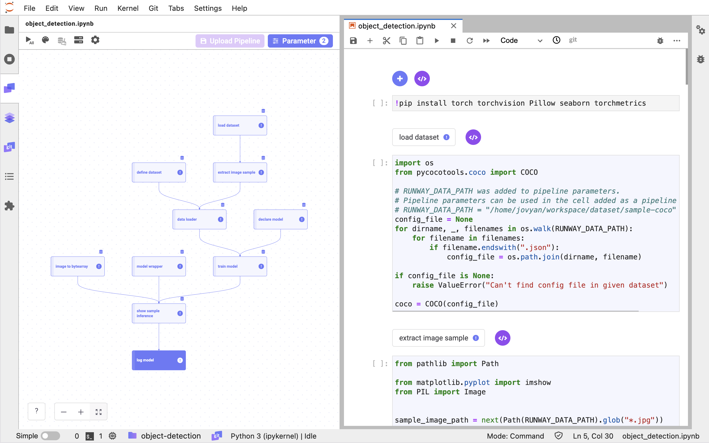
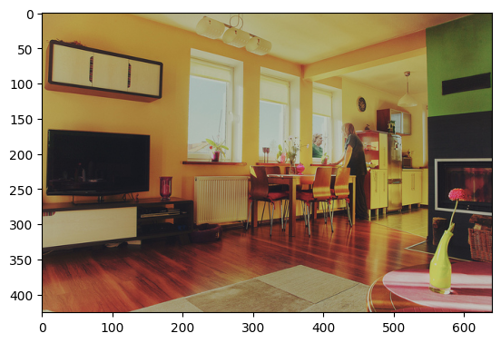
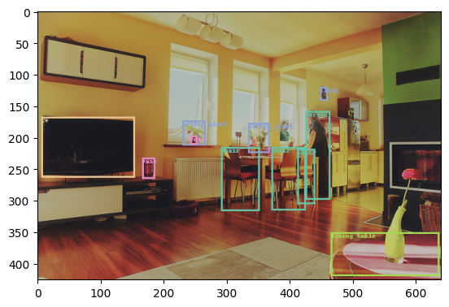
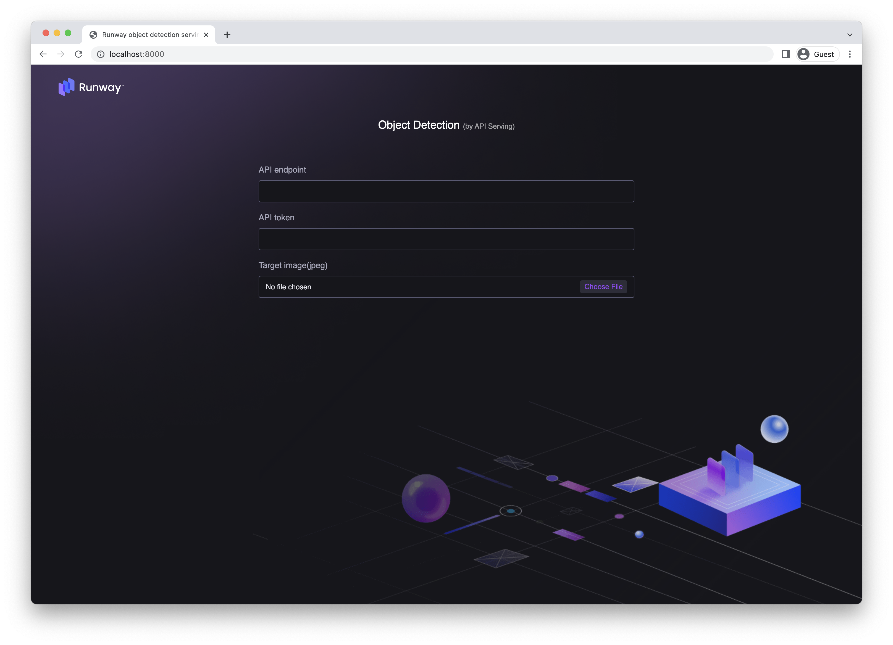
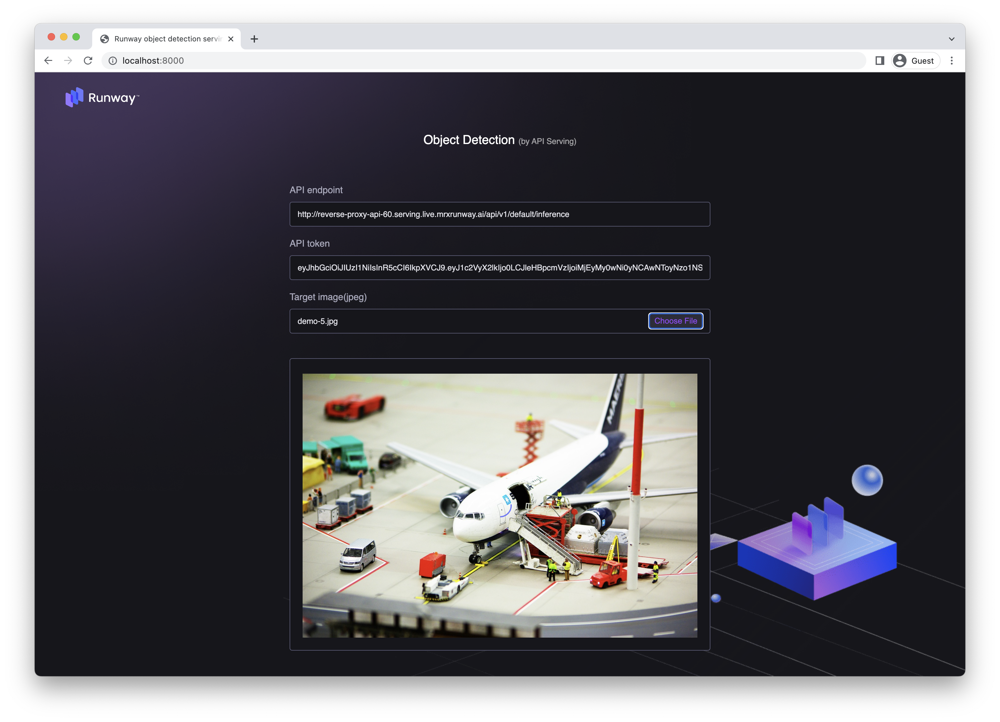
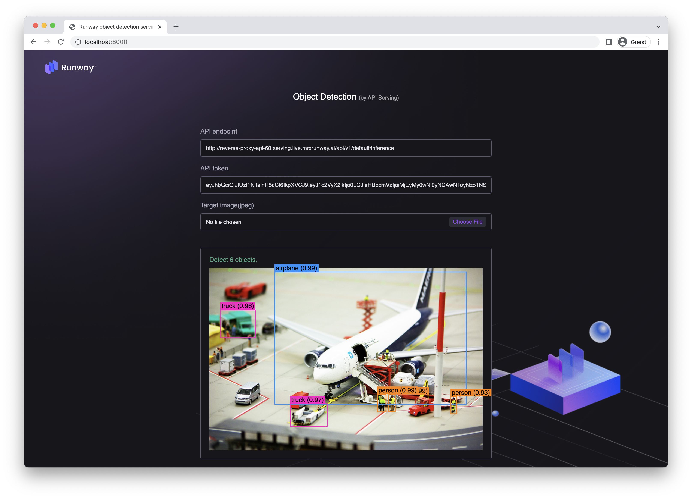

# 객체 탐지 (Object Detection)

<h4 align="center">
    <p>
        <b>한국어</b> |
        <a href="README_en.md">English</a>
    <p>
</h4>

<h3 align="center">
    <p>The MLOps platform to Let your AI run</p>
</h3>

## 소개

이 튜토리얼은 COCO 데이터 세트를 활용하여 객체 탐지를 수행하는 모델을 생성합니다. 작성한 모델 학습 코드를 재학습에 활용하기 위해 파이프라인을 구성하고 저장합니다.

> 📘 빠른 실행을 위해 아래의 주피터 노트북을 활용할 수 있습니다.  
> 아래의 주피터 노트북을 다운로드 받아 실행할 경우, "my-detection-model" 이름의 모델이 생성되어 Runway에 저장됩니다.
> 
> **[object detection notebook](https://drive.google.com/uc?export=download&id=1WgdswAqXZtRE-BMJXpiFIBYHV-oboV4F)**




### 패키지 설치

1. 튜토리얼에서 사용할 패키지를 설치합니다.
    ```python
    !pip install torch torchvision Pillow seaborn torchmetrics
    ```

## 데이터

공개된 오픈 데이터 세트인 COCO 데이터 세트의 일부를 사용합니다.

> 📘 이 튜토리얼에서는 사용할 COCO 샘플 데이터 세트는 `./dataset` 경로에 위치하고 있으며, 필요할 경우 아래 링크를 통해 데이터를 다운로드할 수 있습니다.
> **[coco-sample-dataset.zip](https://drive.google.com/uc?export=download&id=1TrM3y8aRRmaYnIlDI902p73Lsw0XC89B)**

### 데이터 불러오기

1. 파일 탐색기에서 데이터 세트 파일의 경로를 확인합니다.
2. RUNWAY_DATA_PATH 파라미터에 데이터 파일의 경로를 할당합니다.
   
    ```python
    import os
    from pycocotools.coco import COCO

    RUNWAY_DATA_PATH = "/home/jovyan/workspace/examples/tutorial/object_detection/dataset"
    config_file = None
    for dirname, _, filenames in os.walk(RUNWAY_DATA_PATH):
        for filename in filenames:
            if filename.endswith(".json"):
                config_file = os.path.join(dirname, filename)

    if config_file is None:
        raise ValueError("Can't find config file in given dataset")

    coco = COCO(config_file)
    ```

### 예제 데이터 추출

1. 샘플 데이터 하나를 추출 후 이미지를 확인합니다.

    ```python
    from pathlib import Path

    from matplotlib.pyplot import imshow
    from PIL import Image


    sample_image_path = next(Path(RUNWAY_DATA_PATH).glob("*.jpg"))
    image_filename_list = [sample_image_path]

    img = Image.open(sample_image_path)
    imshow(img)
    ```

    


### COCO 데이터 세트

1. 모델을 학습하기 위해서 pytorch에서 제공하는 Dataset을 생성합니다.

    ```python
    from PIL import Image
    from pathlib import Path
    
    import torch
    from pycocotools.coco import COCO
    from torch.utils.data import Dataset
    from torchvision import transforms as T


    def get_transforms():
        transforms = []
        transforms.append(T.ToTensor())
        return T.Compose(transforms)


    def collate_fn(batch):
        return tuple(zip(*batch))


    class COCODataset(Dataset):
        def __init__(self, data_root, coco, transforms=None):
            self.data_root = Path(data_root)
            self.transforms = transforms
            # pre-loaded variables
            self.coco = coco
            self.ids = list(sorted(self.coco.imgs.keys()))

        def __getitem__(self, index):
            ## refer to https://pytorch.org/tutorials/intermediate/torchvision_tutorial.html
            img_id = self.ids[index]
            ann_ids = self.coco.getAnnIds(imgIds=img_id)
            ann = self.coco.loadAnns(ann_ids)
            img_path = self.data_root / self.coco.loadImgs(img_id)[0]["file_name"]
            img = Image.open(img_path)
            num_objs = len(ann)

            boxes = []
            for i in range(num_objs):
                boxes.append([
                    ann[i]["bbox"][0],
                    ann[i]["bbox"][1],
                    ann[i]["bbox"][2] + ann[i]["bbox"][0],
                    ann[i]["bbox"][3] + ann[i]["bbox"][1],
                ])

            areas = []
            for i in range(num_objs):
                areas.append(ann[i]["area"])

            target = {
                "boxes": torch.as_tensor(boxes, dtype=torch.float32),
                "labels": torch.ones((num_objs,), dtype=torch.int64),
                "image_id": torch.tensor([img_id]),
                "area": torch.as_tensor(areas, dtype=torch.float32),
                "iscrowd": torch.zeros((num_objs,), dtype=torch.int64),
            }

            ## transform image
            if self.transforms is not None:
                img = self.transforms(img)

            return img, target

        def __len__(self):
            return len(self.ids)
    ```

2. 선언한 데이터를 이용해 데이터 로더를 생성합니다.

    ```python
    from torch.utils.data import DataLoader

    ## Define Train dataset
    data_root = Path(RUNWAY_DATA_PATH).parent
    dataset = COCODataset(data_root, coco, get_transforms())

    data_loader = DataLoader(
        dataset,
        batch_size=2,
        shuffle=True,
        num_workers=4,
        collate_fn=collate_fn
    )
    ```

## 모델

### 모델 선언

1. 학습에 사용할 모델을 선언합니다. 튜토리얼에서는 pytorch의 `fasterrcnn_resnet50_fpn` 모델을 사용합니다.
    ```python
    import torch
    from torchvision.models.detection import fasterrcnn_resnet50_fpn


    # Define local variables
    print(torch.cuda.is_available())
    device = torch.device("cuda") if torch.cuda.is_available() else torch.device("cpu")

    try:
        entrypoints = torch.hub.list('pytorch/vision', force_reload=True)
        model = fasterrcnn_resnet50_fpn(weights="DEFAULT").to(device)
    except:
        model = fasterrcnn_resnet50_fpn(weights=None, weights_backbone=None).to(device)
    ```

### 모델 학습

> 📘 Link 파라미터 등록 가이드는 **[파이프라인 파라미터 설정](https://docs.live.mrxrunway.ai/guide/core-features/dev-instances/set-pipeline-parameters/)** 문서에서 확인할 수 있습니다.

1. 모델을 학습할 Epoch 을 설정할 수 있도록 Link 파라미터로 N_EPOCHS 에 1을 등록합니다.
2. 선언한 모델을 위에서 만든 데이터 로더를 통해 학습하고 모델의 성능을 평가합니다.

    ```python
    import torch.optim as optim
    from torchmetrics.detection import MeanAveragePrecision

    params = [p for p in model.parameters() if p.requires_grad]
    optimizer = optim.SGD(params, lr=1e-5)

    model.train()
    for epoch in range(N_EPOCHS):
        for imgs, annotations in data_loader:
            imgs = list(img.to(device) for img in imgs)
            annotations = [{k: v.to(device) for k, v in t.items()} for t in annotations]
            loss_dict = model(imgs, annotations)
            losses = sum(loss for loss in loss_dict.values())

            optimizer.zero_grad()
            losses.backward()
            optimizer.step()

    map_metric = MeanAveragePrecision().to(device)
    model.eval()
    with torch.no_grad():
        preds = []
        annos = []
        for imgs, annotations in data_loader:
            pred = model(list(img.to(device) for img in imgs))
            anno = [{k: v.to(device) for k, v in t.items()} for t in annotations]
            preds.extend(pred)
            annos.extend(anno)

    map_metric.update(preds, annos)
    map_score = map_metric.compute()

    torch.cuda.empty_cache()
    ```

### 모델 추론

#### 모델 랩핑 클래스 선언

1. 학습된 모델을 서빙할 수 있도록 ModelWrapper를 작성합니다.
    ```python
    import io
    import base64

    import torch
    import pandas as pd
    import numpy as np
    from torchvision import transforms
    from PIL import Image, ImageDraw, ImageFont


    class ModelWrapper:
        def __init__(self, model, device):
            self.model = model
            self.device = device

        def bytesarray_to_tensor(self, bytes_array: str):
            # input : "utf-8" decoded bytes_array
            encoded_bytes_array = bytes_array.encode("utf-8")
            # decode encoded_bytes_array with ascii code
            img_64_decode = base64.b64decode(encoded_bytes_array)
            # get image file and transform to tensor
            image_from_bytes = Image.open(io.BytesIO(img_64_decode))
            return transforms.ToTensor()(image_from_bytes).to(self.device)

        def numpy_to_bytesarray(self, numpy_array):
            numpy_array_bytes_array = numpy_array.tobytes()
            numpy_array_64_encode = base64.b64encode(numpy_array_bytes_array)
            bytes_array = numpy_array_64_encode.decode("utf-8")
            return bytes_array

        def draw_detection(self, img_tensor, bboxes, labels, scores, out_img_file):
            """Draw detection result."""
            img_array = img_tensor.permute(1, 2, 0).numpy() * 255
            img = Image.fromarray(img_array.astype(np.uint8))
            
            draw = ImageDraw.Draw(img)    
            font = ImageFont.load_default()
            bboxes = bboxes.cpu().numpy().astype(np.int32)
            labels = labels.cpu().numpy()
            scores = scores.cpu().numpy()
            for box, label, score in zip(bboxes, labels, scores):        
                draw.rectangle([(box[0], box[1]), (box[2], box[3])], outline="red", width=1)  
                text = f"{label}: {score:.2f}"
                draw.text((box[0], box[1]), text, fill="red", font=font)
            img.save(out_img_file)
            return img

        @torch.no_grad()
        def predict(self, df):
            self.model.eval()
            # df is 1-d dataframe with bytes array
            tensor_list = list((map(self.bytesarray_to_tensor, df.squeeze(axis=1).to_list())))

            pred_images = []
            pred_image_shape_c = []
            pred_image_shape_h = []
            pred_image_shape_w = []
            pred_image_dtypes = []

            boxes = []
            labels = []
            scores = []

            boxes_dtypes = []
            labels_dtypes = []
            scores_dtypes = []

            for img in tensor_list:
                output = self.model(img.unsqueeze(0))
                detect_img = self.draw_detection(
                    img_tensor=img,
                    bboxes=output[0]["boxes"],
                    labels=output[0]["labels"],
                    scores=output[0]["scores"],
                    out_img_file="test.png",
                )
                detect_img = np.array(detect_img)
                h, w, c = detect_img.shape
                box = output[0]["boxes"].cpu().numpy()
                label = output[0]["labels"].cpu().numpy()
                score = output[0]["scores"].cpu().numpy()

                pred_images += [detect_img]
                boxes += [box]
                labels += [label]
                scores += [score]

                pred_image_shape_c += [c]
                pred_image_shape_h += [h]
                pred_image_shape_w += [w]

                pred_image_dtypes += [str(detect_img.dtype)]
                boxes_dtypes += [str(box.dtype)]
                labels_dtypes += [str(label.dtype)]
                scores_dtypes += [str(score.dtype)]

                torch.cuda.empty_cache()

            meta = pd.DataFrame({
                "pred_image_shape_c": pred_image_shape_c,
                "pred_image_shape_h": pred_image_shape_h,
                "pred_image_shape_w": pred_image_shape_w,
                "output_dtype": pred_image_dtypes,
                "boxes_dtypes": boxes_dtypes,
                "labels_dtypes": labels_dtypes,
                "scores_dtypes": scores_dtypes,
            })
            img_byte = pd.DataFrame({
                "output": pred_images,
                "boxes": boxes,
                "labels": labels,
                "scores": scores,
                # "true": tensor_list,
            }).applymap(lambda x: self.numpy_to_bytesarray(x))
            return pd.concat([meta, img_byte], axis="columns")
    ```

#### 샘플 이미지 추론

1. Runway에서는 API 서빙을 위한 입력과 출력을 Dataframe 형식만 지원하고 있습니다. 이를 위해서 입력 이미지를 bytearray로 변환해주는 코드를 작성합니다.

    ```python
    import base64
    import pandas as pd


    def convert_image_to_bytearray(img_binary):
        image_64_encode = base64.b64encode(img_binary)
        bytes_array = image_64_encode.decode("utf-8")
        return bytes_array


    def images_to_bytearray_df(image_filename_list: list):
        df_list = []
        for img_filename in image_filename_list:
            image = open(img_filename, "rb")  # open binary file in read mode
            image_read = image.read()
            df_list.append(convert_image_to_bytearray(image_read))
        return pd.DataFrame(df_list, columns=["image_data"])
    ```

2. 위에서 사용한 데이터와 변환 코드를 이용해 `input_sample` 을 생성하고 모델을 랩핑한 객체를 이용해 추론합니다.

    ```python
    model = model.cpu()
    device = "cpu"
    serve_model = ModelWrapper(model=model, device=device)

    # make input sample
    input_sample = images_to_bytearray_df(image_filename_list)

    # For inference
    pred = serve_model.predict(input_sample)

    output = pred.loc[0]
    data, dtype = output["output"], output["output_dtype"]
    c, h, w = output["pred_image_shape_c"], output["pred_image_shape_h"], output["pred_image_shape_w"]

    type_dict = {"uint8": np.uint8, "float32": np.float32, "int64": np.int64}
    pred_decode = base64.b64decode(data)
    pred_array = np.frombuffer(pred_decode, dtype=type_dict[dtype])

    img = Image.fromarray(pred_array.reshape(h, w, c))

    imshow(img)
    ```

3. 추론 결과를 확인합니다.

   

### 모델 등록

학습이 완료된 모델을 Runway에 등록하여 추론 서비스에서 사용할 수 있도록 합니다.

1. Runway 플랫폼의 모델 등록 코드 스니펫을 사용하여, 학습이 완료된 모델을 등록(`log_model`)하고 관련 정보를 기록합니다.
   
    ```python
    import mlflow
    import runway

    del map_score["classes"]
    with mlflow.start_run():
        mlflow.log_metrics(map_score)

        runway.log_model(
            model=serve_model,
            input_samples={"predict": input_sample},
            model_name="my-detection-model",
    )
    ```

## 파이프라인 구성 및 저장

> 📘 파이프라인 생성 방법에 대한 구체적인 가이드는 **[파이프라인 구성](https://docs.live.mrxrunway.ai/guide/core-features/dev-instances/create-a-pipeline/)** 문서에서 확인할 수 있습니다.

1. **Link**에서 파이프라인을 작성하고 정상 실행 여부를 확인합니다.
2. 정상 실행 확인 후, Link pipeline 패널의 **Upload pipeline** 버튼을 클릭합니다.
3. **New Pipeline** 버튼을 클릭합니다.
4. **Pipeline** 필드에 Runway에 저장할 이름을 작성합니다.
5. **Pipeline version** 필드에는 자동으로 버전 1이 선택됩니다.
6. **Upload** 버튼을 클릭합니다.
7. 업로드가 완료되면 프로젝트 내 Pipeline 페이지에 업로드한 파이프라인 항목이 표시됩니다.


## 모델 배포

> 📘 모델 배포 방법에 대한 구체적인 가이드는 **[모델 배포](https://docs.live.mrxrunway.ai/guide/core-features/inference-services/deploying-models/)** 문서에서 확인할 수 있습니다.

## 데모 사이트

1. 배포된 모델을 실험하기 위한 [데모 사이트](http://demo.service.mrxrunway.ai/object)에 접속합니다.
2. 데모사이트에 접속하면 아래와 같은 화면이 나옵니다.

    

3. API Endpoint, 발급 받은 API Token, 예측에 사용할 이미지를 업로드합니다.

    

4. 결과를 받을 수 있습니다.

    
