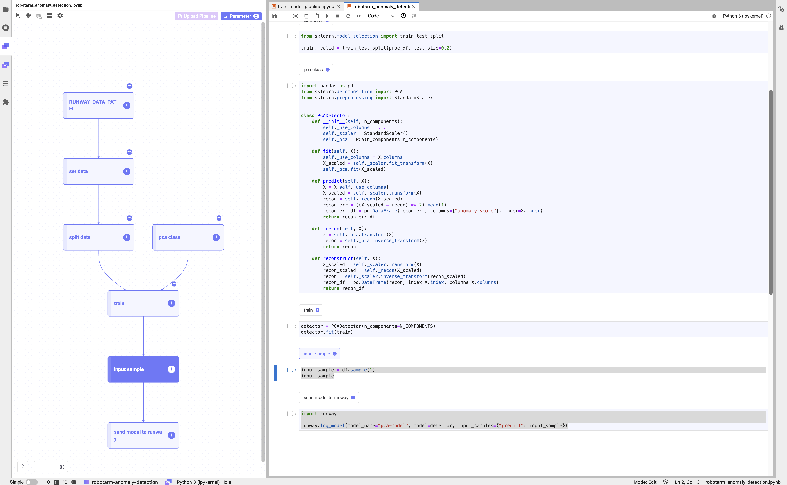
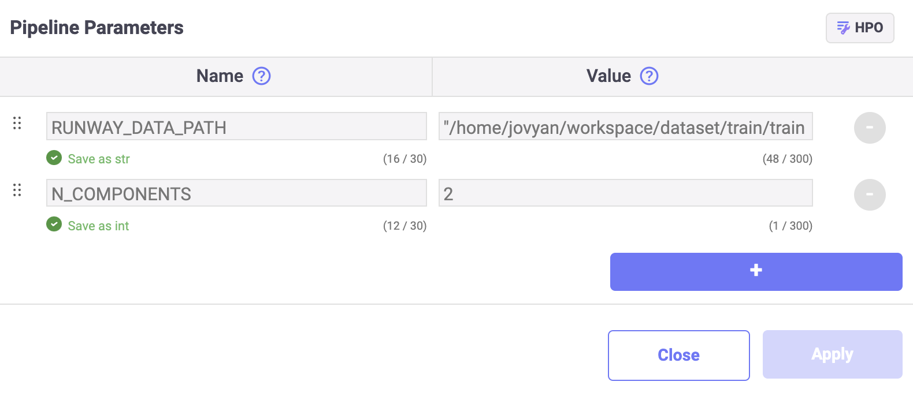

# 로봇팔 이상 탐지 (Robotarm Anomaly Detection)

<h4 align="center">
    <p>
        <b>한국어</b> |
        <a href="README_en.md">English</a>
    <p>
</h4>

<h3 align="center">
    <p>The MLOps platform to Let your AI run</p>
</h3>

## 소개

이 튜토리얼은 4축 로봇팔의 움직임을 모사한 데이터를 이용한 이상 탐지 모델을 학습하여 저장합니다. 작성한 모델 학습 코드를 재학습에 활용하기 위해 파이프라인을 구성하고 저장합니다.

> 📘 빠른 실행을 위해 아래의 주피터 노트북을 활용할 수 있습니다.  
> 아래의 주피터 노트북을 다운로드 받아 실행할 경우, "pca-model" 이름의 모델이 생성되어 Runway에 저장됩니다.
>
> **[robotarm anomaly detection notebook](https://drive.google.com/uc?export=download&id=10d2Hc4lYx0WOuEvLOkqNTQMpDezbzVzw)**



### 패키지 설치

1. (Optional) 튜토리얼에서 사용할 패키지를 설치합니다.
    ```python
    !pip install pandas scikit-learn
    ```

## 데이터
Runway 튜토리얼 폴더에 포함된 CSV 파일을 불러와 데이터 세트를 생성하고, 전처리합니다.

> 📘 이 튜토리얼에서는 4축 로봇팔의 움직임을 모사한 샘플 데이터를 사용합니다.
> 로봇팔 데이터 세트는 `./dataset` 경로에 위치하고 있으며, 필요할 경우 아래 링크를 통해 데이터를 다운로드할 수 있습니다.
> **[robotarm-train.csv](https://drive.google.com/uc?export=download&id=1Ks8SUVBQawiKW0q0zQT1sc9um618cdEE)**

### 데이터 불러오기

1. 파일 탐색기에서 데이터 세트 파일의 경로를 확인합니다.
2. RUNWAY_DATA_PATH 파라미터에 데이터 파일의 경로를 할당합니다.
    ```python
    import os
    import pandas as pd

    RUNWAY_DATA_PATH = "/home/jovyan/workspace/examples/tutorial/robotarm_anomaly_detection/dataset"
    dfs = []
    for dirname, _, filenames in os.walk(RUNWAY_DATA_PATH):
        for filename in filenames:
            if filename.endswith(".csv"):
                d = pd.read_csv(os.path.join(dirname, filename))
            elif filename.endswith(".parquet"):
                d = pd.read_parquet(os.path.join(dirname, filename))
            else:
                raise ValueError("Not valid file type")
            dfs += [d]
    df = pd.concat(dfs)
    ```

### 데이터 전처리

1. 데이터 세트에 인덱스를 설정하고 id 값을 제거한뒤, 총 1000개의 데이터만 사용합니다.

    ```python
    proc_df = df.set_index("datetime").drop(columns=["id"]).tail(1000)
    ```

2. 데이터 세트를 학습용 데이터 세트와 테스트용 데이터 세트로 분리합니다.

    ```python
    from sklearn.model_selection import train_test_split

    train, valid = train_test_split(proc_df, test_size=0.2, random_state=2024)
    ```

## 모델

### 모델 클래스

1. 모델 학습을 위한 모델 클래스를 작성합니다.

    ```python
    import pandas as pd
    from sklearn.decomposition import PCA
    from sklearn.preprocessing import StandardScaler


    class PCADetector:
        def __init__(self, n_components):
            self._use_columns = ...
            self._scaler = StandardScaler()
            self._pca = PCA(n_components=n_components)

        def fit(self, X):
            self._use_columns = X.columns
            X_scaled = self._scaler.fit_transform(X)
            self._pca.fit(X_scaled)

        def predict(self, X):
            X = X[self._use_columns]
            X_scaled = self._scaler.transform(X)
            recon = self._recon(X_scaled)
            recon_err = ((X_scaled - recon) ** 2).mean(1)
            recon_err_df = pd.DataFrame(recon_err, columns=["anomaly_score"], index=X.index)
            return recon_err_df

        def _recon(self, X):
            z = self._pca.transform(X)
            recon = self._pca.inverse_transform(z)
            return recon

        def reconstruct(self, X):
            X_scaled = self._scaler.transform(X)
            recon_scaled = self._recon(X_scaled)
            recon = self._scaler.inverse_transform(recon_scaled)
            recon_df = pd.DataFrame(recon, index=X.index, columns=X.columns)
            return recon_df
    ```

### 모델 학습

> 📘 Link 파라미터 등록 가이드는 **[파이프라인 파라미터](https://docs.live.mrxrunway.ai/guide/core-features/dev-instances/set-pipeline-parameters/)** 문서에서 확인할 수 있습니다.

1. PCA에서 사용할 컴포넌트의 개수를 지정하기 위해서 Link 파라미터로 N_COMPONENTS 에 2 를 등록합니다.

    - `N_COMPONENTS`: 2

    

2. 선언한 모델 클래스에 Link 파라미터를 입력하고 학습용 데이터 세트를 활용하여 모델을 학습하고 관련된 정보를 로깅합니다.

    ```python
    parameters = {"n_components": N_COMPONENTS}
    detector = PCADetector(n_components=parameters["n_components"])
    detector.fit(train)

    train_pred = detector.predict(train)
    valid_pred = detector.predict(valid)

    mean_train_recon_err = train_pred.mean()
    mean_valid_recon_err = valid_pred.mean()
    ```

### 모델 등록

학습이 완료된 모델을 Runway에 등록하여 추론 서비스에서 사용할 수 있도록 합니다.

1. Runway 플랫폼의 모델 등록 코드 스니펫을 사용하여, 학습이 완료된 모델을 등록(`log_model`)하고 관련 정보를 기록합니다.
    ```python
    import mlflow
    import runway

    with mlflow.start_run():
        mlflow.log_params(parameters)

        mlflow.log_metric("mean_train_recon_err", mean_train_recon_err)
        mlflow.log_metric("mean_valid_recon_err", mean_valid_recon_err)

        runway.log_model(
            model=detector,
            input_samples={"predict": proc_df.sample(1)},
            model_name="pca-model",
        )
    ```

## 파이프라인 구성 및 저장

> 📘 파이프라인 생성 방법에 대한 구체적인 가이드는 **[파이프라인 구성](https://docs.live.mrxrunway.ai/guide/core-features/dev-instances/create-a-pipeline/)** 문서에서 확인할 수 있습니다.

1. **Link**에서 파이프라인을 작성하고 정상 실행 여부를 확인합니다.
2. 정상 실행 확인 후, Link pipeline 패널의 **Upload pipeline** 버튼을 클릭합니다.
3. **New Pipeline** 버튼을 클릭합니다.
4. **Pipeline** 필드에 Runway에 저장할 이름을 작성합니다.
5. **Pipeline version** 필드에는 자동으로 버전 1이 선택됩니다.
6. **Upload** 버튼을 클릭합니다.
7. 업로드가 완료되면 프로젝트 내 Pipeline 페이지에 업로드한 파이프라인 항목이 표시됩니다.

