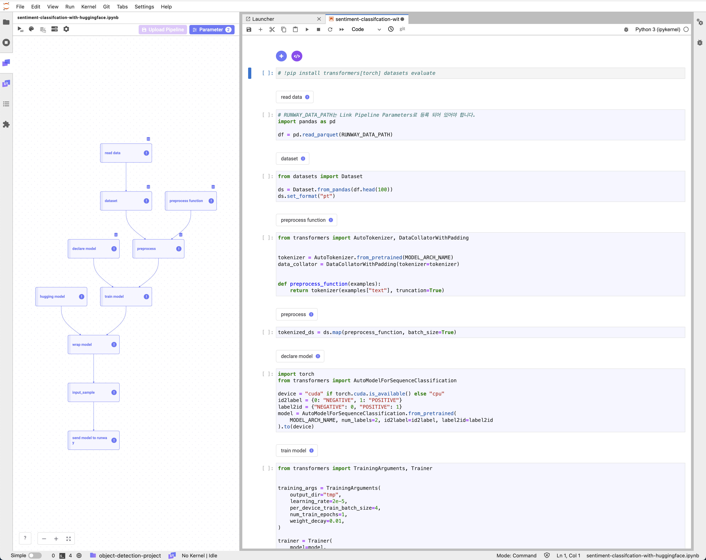
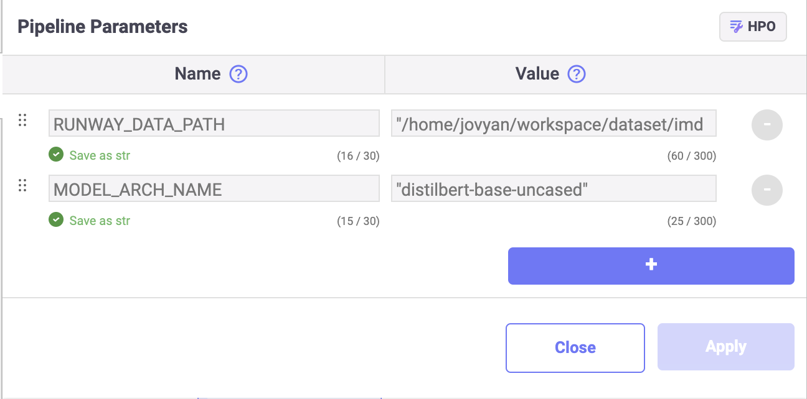
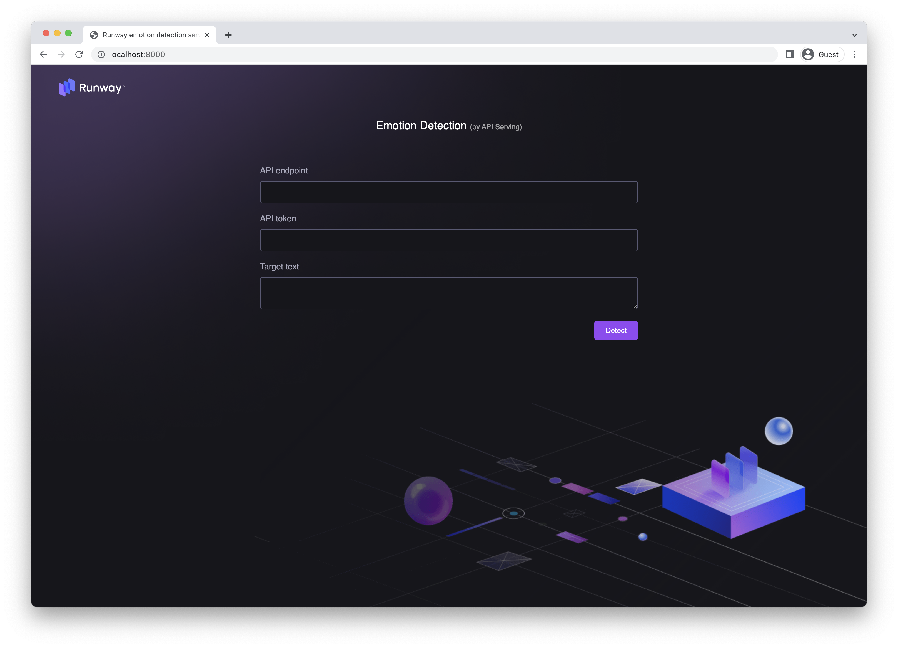
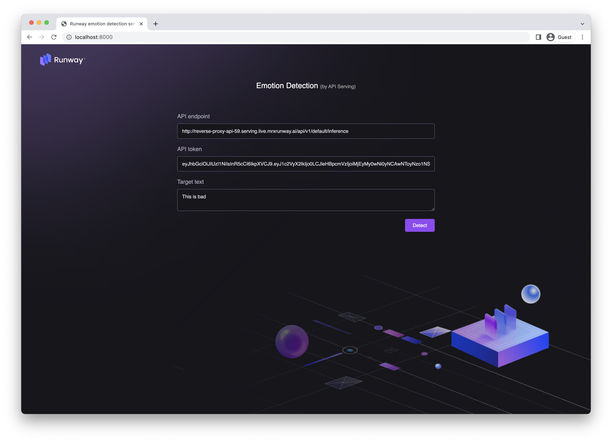
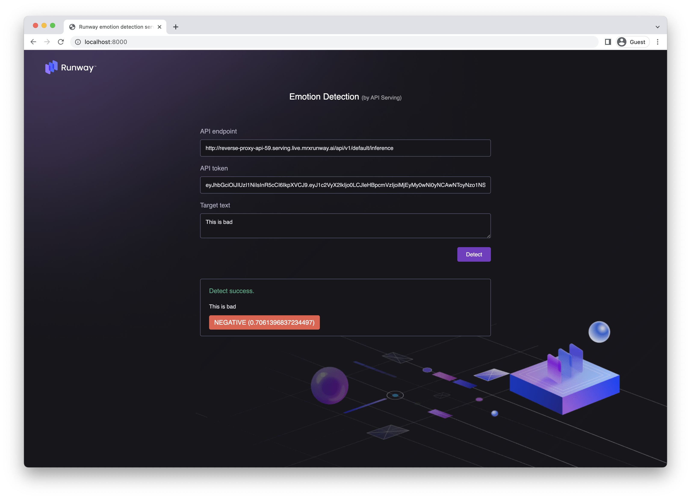

# Sentiment Classification with Huggingface

<h4 align="center">
    <p>
        <b>한국어</b> |
        <a href="README_en.md">English</a>
    <p>
</h4>

<h3 align="center">
    <p>The MLOps platform to Let your AI run</p>
</h3>

## Introduction

Runway에 포함된 Link를 사용하여 Huggingface 모델을 학습하고 저장합니다.  
작성한 모델 학습 코드를 재학습에 활용하기 위해 파이프라인을 구성하고 저장합니다.

> 📘 빠른 실행을 위해 아래의 주피터 노트북을 활용할 수 있습니다.  
> 아래의 주피터 노트북을 다운로드 받아 실행할 경우, "my-text-model" 이름의 모델이 생성되어 Runway에 저장됩니다.
>
> **[sentiment classification with huggingface](https://drive.google.com/uc?export=download&id=1lbONDH69PuaJXrlxed3P6UlCfLAWaoqo)**



## Runway

> 📘 이 튜토리얼은 Stanford 에서 제공하는 imdb 데이터셋을 재가공해 업로드한 [huggingface 의 데이터 셋](https://huggingface.co/datasets/imdb/tree/refs%2Fconvert%2Fparquet/plain_text)입니다. 해당 데이터셋을 이용해 감성 분석을 진행할 수 있습니다.
>
> IMDB 데이터셋은 아래 항목을 클릭하여 다운로드할 수 있습니다.  
> **[IMDB test dataset](https://drive.google.com/uc?export=download&id=1QlIzPfOw_b0xXnXM6rxnW3Vbr-VDm0At)**

### 데이터 세트 생성하기

> 📘 데이터셋 생성에 관한 자세한 내용은 [공식 문서](https://docs.live.mrxrunway.ai/Guide/ml_development/datasets/dataset-runway/)를 참고하세요.

1. Runway 프로젝트 메뉴에서 데이터셋 페이지로 이동합니다.
2. 데이터 세트 메뉴에서 데이터 세트 생성 메뉴에 진입합니다. 
    - 좌측 데이터 세트 목록 상단 `+` 버튼을 클릭합니다.
    - 초기 화면에서 `Create` 버튼을 클릭합니다.
3. 다이얼로그에서 생성할 데이터 세트의 이름을 입력 후 `Create` 버튼을 클릭합니다.

### 데이터 세트 버전 생성하기

1. `Versions 섹션`에서  `Create version` 버튼을 클릭합니다. 
2. 다이얼로그에서 `Local file`을 선택합니다.
3. 저장하는 데이터셋의 이름과 설명을 입력합니다.
4. 데이터셋으로 생성할 파일을 파일 탐색기로 선택하거나, Drag&Drop으로 입력합니다.
5. `Create`를 클릭합니다.

## Link

### 패키지 설치

1. 튜토리얼에서 사용할 패키지를 설치합니다.

```python
!pip install transformers[torch] datasets evaluate
```

### 데이터

#### 데이터 불러오기

> 📘 데이터 세트 불러오는 방법에 대한 구체적인 가이드는 **[데이터 세트 가져오기](https://docs.live.mrxrunway.ai/Guide/ml_development/dev_instances/%EB%8D%B0%EC%9D%B4%ED%84%B0_%EC%84%B8%ED%8A%B8_%EA%B0%80%EC%A0%B8%EC%98%A4%EA%B8%B0/)** 가이드 에서 확인할 수 있습니다.

1. 노트북 셀 상단의 **Add Runway Snippet** 버튼을 클릭합니다.
2. **Import Dataset** 를 선택합니다. 
3. 사용할 데이터 세트의 버전을 선택하고 **Save** 버튼을 클릭합니다.
4. 버튼 클릭 시 노트북 셀 내 선택한 데이터 세트 내 파일 목록을 조회할 수 있는 스니펫이 작성되며, 해당 데이터 세트 경로를 값으로 갖는 데이터 세트 파라미터가 추가됩니다.  
5. 데이터 세트를 불러오고자 하는 노트북 셀에서 등록된 데이터 세트 파라미터의 이름을 입력하여 작업에 활용합니다.
    ```python
    import os
    import pandas as pd

    dfs = []
    for dirname, _, filenames in os.walk(RUNWAY_DATA_PATH):
        for filename in filenames:
            if filename.endswith(".csv"):
                d = pd.read_csv(os.path.join(dirname, filename))
            elif filename.endswith(".parquet"):
                d = pd.read_parquet(os.path.join(dirname, filename))
            else:
                raise ValueError("Not valid file type")
            dfs += [d]
    df = pd.concat(dfs)
    ```

6. Pandas 데이터 프레임으로 Huggingface Dataset 을 생성합니다.
    ```python
    from datasets import Dataset

    ds = Dataset.from_pandas(df.sample(1000))
    ds.set_format("pt")
    ```

#### 데이터 전처리

> 📘 Link 파라미터 등록 가이드는 **[파이프라인 파라미터 설정](https://docs.live.mrxrunway.ai/Guide/ml_development/dev_instances/%ED%8C%8C%EC%9D%B4%ED%94%84%EB%9D%BC%EC%9D%B8_%ED%8C%8C%EB%9D%BC%EB%AF%B8%ED%84%B0_%EC%84%A4%EC%A0%95/)** 문서에서 확인할 수 있습니다.

1. 토크나이저로 사용할 아키텍쳐를 정하기 위해서 Link 파라미터로 `MODEL_ARCH_NAME` 에 `"distilbert-base-uncased"` 를 등록합니다.

    

2. 토크나이저를 불러오고 전처리 코드를 작성합니다.

    ```python
    from transformers import AutoTokenizer, DataCollatorWithPadding


    tokenizer = AutoTokenizer.from_pretrained(MODEL_ARCH_NAME)
    data_collator = DataCollatorWithPadding(tokenizer=tokenizer)


    def preprocess_function(examples):
        return tokenizer(examples["text"], truncation=True)
    ```

3. 데이터에 전처리를 수행합니다.

    ```python
    tokenized_ds = ds.map(preprocess_function, batch_size=True)
    ```

### 모델 학습

1. Transformer 의 `AutoModelForSequenceClassification` 모듈을 이용해 모델을 불러옵니다.

    ```python
    import torch
    from transformers import AutoModelForSequenceClassification

    device = "cuda" if torch.cuda.is_available() else "cpu"
    id2label = {0: "NEGATIVE", 1: "POSITIVE"}
    label2id = {"NEGATIVE": 0, "POSITIVE": 1}
    model = AutoModelForSequenceClassification.from_pretrained(
        MODEL_ARCH_NAME, num_labels=2, id2label=id2label, label2id=label2id
    ).to(device)
    ```

2. 불러온 모델과 학습용 데이터셋을 활용하여, 모델 학습을 수행합니다.

    ```python
    from transformers import TrainingArguments, Trainer


    train_params = {
        "learning_rate": 2e-5,
        "per_device_train_batch_size": 4,
        "num_train_epochs": 1,
        "weight_decay": 0.01,
    }

    training_args = TrainingArguments(
        output_dir="tmp",
        learning_rate=train_params["learning_rate"],
        per_device_train_batch_size=train_params["per_device_train_batch_size"],
        num_train_epochs=train_params["num_train_epochs"],
        weight_decay=train_params["weight_decay"],
    )

    trainer = Trainer(
        model=model,
        args=training_args,
        train_dataset=tokenized_ds,
        tokenizer=tokenizer,
        data_collator=data_collator,
    )

    trainer.train()
    ```

### 모델 업로드

#### 모델 랩핑 클래스

1. API 서빙에 이용할 수 있도록 `HuggingModel` 클래스를 작성합니다.

    ```python
    import pandas as pd


    class HuggingModel:
        def __init__(self, pipeline):
            self.pipeline = pipeline

        def predict(self, X):
            result = self.pipeline(X["text"].to_list())
            return pd.DataFrame.from_dict(result)
    ```

2. Transformer 파이프라인을 생성하고 `HuggingModel` 로 랩핑합니다.

    ```python
    from transformers import pipeline


    model = model.to("cpu")
    pipe = pipeline("text-classification", model=model, tokenizer=tokenizer)

    hug_model = HuggingModel(pipe)
    ```

3. 모델을 평가합니다.

    ```python
    from sklearn.metrics import accuracy_score, roc_curve, roc_auc_score

    # validate

    valid_pred = hug_model.predict(valid)

    label = valid["label"]
    pred = valid_pred["label"].map(label2id)
    score = valid_pred["score"]

    acc_score = accuracy_score(label, pred)
    roc_score = roc_auc_score(label, score)
    ```

#### 모델 업로드

> 📘 모델 업로드 방법에 대한 구체적인 가이드는 **[모델 업로드](https://docs.live.mrxrunway.ai/Guide/ml_development/dev_instances/%EB%AA%A8%EB%8D%B8_%EC%97%85%EB%A1%9C%EB%93%9C/)** 문서에서 확인할 수 있습니다.

1. 모델 학습에 사용한 학습 데이터의 샘플을 생성합니다.
    ```python
    input_sample = df.sample(1).drop(columns=["label"])
    input_samples
    ```

2. Runway code snippet 의 save model을 사용해 모델을 저장하는 코드를 생성합니다. 그리고 모델과 관련된 정보들도 저장합니다.
    ```python
    import runway

    runway.start_run()
    runway.log_parameters(train_params)
    runway.log_parameter("MODEL_ARCH_NAME", MODEL_ARCH_NAME)
    runway.log_metric("accuracy_score", acc_score)
    runway.log_metric("roc_score", roc_score)

    runway.log_model(model_name="my-text-model", model=hug_model, input_samples={"predict": input_sample})

    ```

## 파이프라인 구성 및 저장

> 📘 파이프라인 생성 방법에 대한 구체적인 가이드는 **[파이프라인 업로드](https://docs.live.mrxrunway.ai/Guide/ml_development/dev_instances/%ED%8C%8C%EC%9D%B4%ED%94%84%EB%9D%BC%EC%9D%B8_%EC%97%85%EB%A1%9C%EB%93%9C/)** 문서에서 확인할 수 있습니다.

1. 파이프라인으로 구성할 코드 셀을 선택하여 컴포넌트로 설정합니다.
2. 파이프라인으로 구성이 완료되면, 전체 파이프라인을 실행하여 정상 동작 여부를 확인합니다.
3. 파이프라인의 정상 동작 확인 후, 파이프라인을 Runway에 저장합니다.
    1. 좌측 패널 영역의 Upload Pipeline을 클릭합니다.
    2. Pipeline 저장 옵션을 선택합니다.
        1. 신규 저장의 경우, New Pipeline을 선택합니다.
        2. 기존 파이프라인의 업데이트일 경우, Version Update를 선택합니다.
    3. 파이프라인 저장을 위한 값을 입력 후, Save를 클릭합니다.
4. Runway 프로젝트 메뉴에서 Pipeline 페이지로 이동합니다.
5. 저장한 파이프라인의 이름을 클릭하면 파이프라인 상세 페이지로 진입합니다.

## 모델 배포

> 📘 모델 배포 방법에 대한 구체적인 가이드는 **[모델 배포](https://docs.live.mrxrunway.ai/Guide/ml_serving/model_deployments/%EB%AA%A8%EB%8D%B8_%EB%B0%B0%ED%8F%AC/)** 문서에서 확인할 수 있습니다.

## 데모 사이트

1. 배포된 모델을 실험하기 위한 [데모 사이트](http://demo.service.mrxrunway.ai/object)에 접속합니다.
2. 데모사이트에 접속하면 아래와 같은 화면이 나옵니다.

    

3. API Endpoint, 발급 받은 API Token, 예측할 문장을 입력합니다.

    

4. 결과를 받을 수 있습니다.

    
