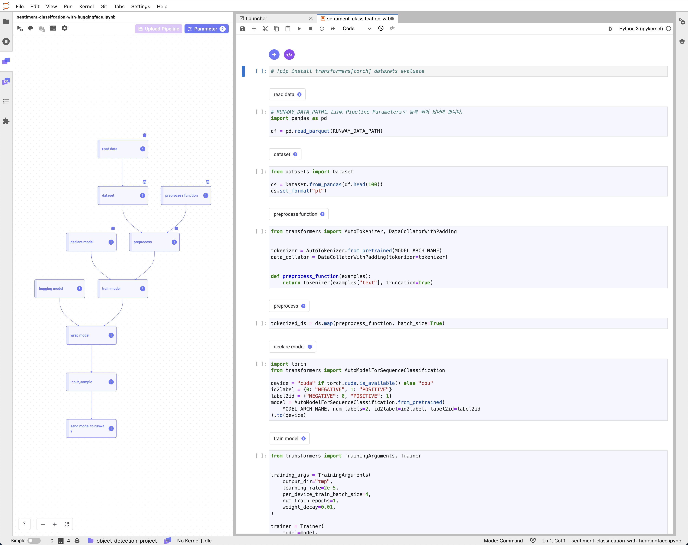
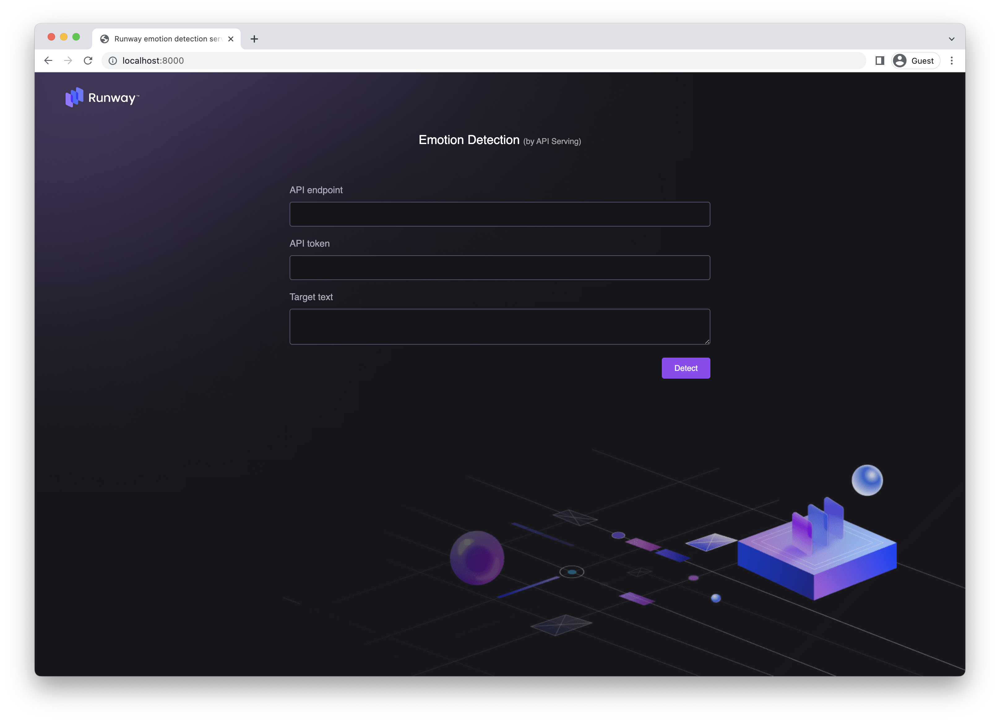
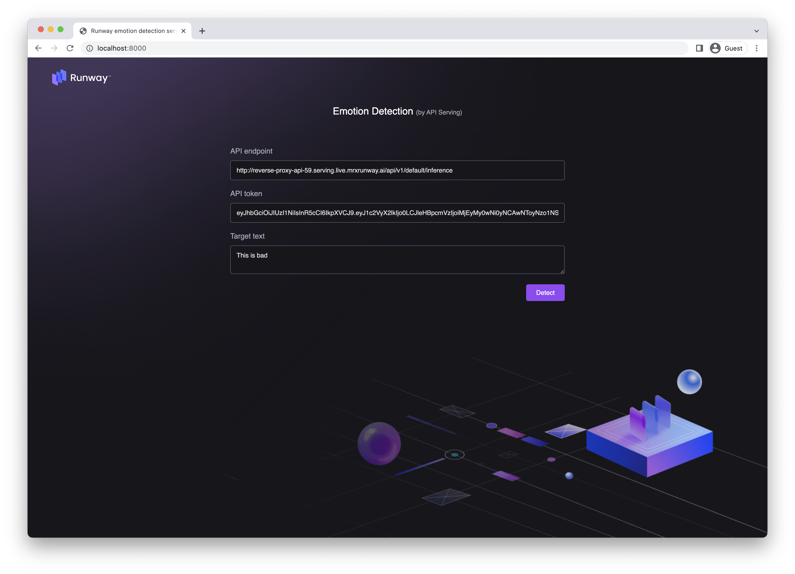
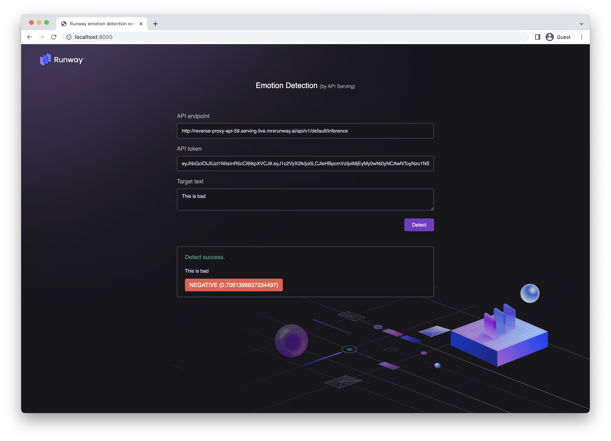

# Sentiment Classification with Huggingface

<h4 align="center">
    <p>
        <a href="README.md">한국어</a> |
        <b>English</b>
    <p>
</h4>

<h3 align="center">
    <p>The MLOps platform to Let your AI run</p>
</h3>

## Introduction

In this tutorial, a Hugging Face model is trained and saved to perform sentiment analysis using the movie review dataset published by the Stanford AI Lab.
The trained model code is then organized into a pipeline to support retraining and reuse.

> 📘 For quick execution, you can utilize the following Jupyter Notebook.  
> If you download and execute the Jupyter Notebook below, a model named "my-text-model" will be created and saved in Runway.
>
> **[sentiment classification with huggingface](https://drive.google.com/uc?export=download&id=1lbONDH69PuaJXrlxed3P6UlCfLAWaoqo)**



### Package Preparation

1. Install the required packages for the tutorial.

    ```python
    !pip install transformers[torch] datasets evaluate
    ```

## Data
This tutorial uses the IMDB dataset, a movie review dataset released by the Stanford AI Lab. Load the Parquet file included in the Runway tutorial folder to create and preprocess the dataset.


> 📘 The IMDB dataset used in this tutorial is a [Hugging Face dataset](https://huggingface.co/datasets/imdb/tree/refs%2Fconvert%2Fparquet/plain_text) that has been reformatted for this tutorial.  
> The dataset file is located in the `./dataset` directory, and can be downloaded from the link below if needed.
> **[IMDB test dataset](https://drive.google.com/uc?export=download&id=1QlIzPfOw_b0xXnXM6rxnW3Vbr-VDm0At)**

### Load Data

1. Check the path of the dataset file in the file explorer.
2. Assign the dataset file path to the RUNWAY_DATA_PATH parameter.
    ```python
    import os
    import pandas as pd

    RUNWAY_DATA_PATH = "/home/jovyan/workspace/examples/tutorial/sentiment_classification_with_huggingface/dataset"
    dfs = []
    for dirname, _, filenames in os.walk(RUNWAY_DATA_PATH):
        for filename in filenames:
            if filename.endswith(".csv"):
                d = pd.read_csv(os.path.join(dirname, filename))
            elif filename.endswith(".parquet"):
                d = pd.read_parquet(os.path.join(dirname, filename))
            else:
                raise ValueError("Not valid file type")
            dfs += [d]
    df = pd.concat(dfs)
    ```

3. Create Huggingface Dataset with Pandas dataframe.

    ```python
    from datasets import Dataset

    ds = Dataset.from_pandas(df.sample(1000))
    ds.set_format("pt")
    ```


### Tokenization

1. Load the model and initialize the tokenizer using the `AutoModelForSequenceClassification` module from **Transformers**.

    ```python
    import torch
    from transformers import AutoTokenizer, AutoModelForSequenceClassification

    # model
    id2label = {0: "NEGATIVE", 1: "POSITIVE"}
    label2id = {"NEGATIVE": 0, "POSITIVE": 1}
    model = AutoModelForSequenceClassification.from_pretrained(
        MODEL_ARCH_NAME, num_labels=2, id2label=id2label, label2id=label2id
    )
    model.config.pad_token_id = model.config.eos_token_id

    # tokenizer
    tokenizer = AutoTokenizer.from_pretrained(MODEL_ARCH_NAME)
    tokenizer.pad_token_id = tokenizer.eos_token_id

    # cuda setting if available
    device = "cuda" if torch.cuda.is_available() else "cpu"
    model.to(device)
    ```

2. Apply the tokenizer to preprocess the data.
   ``` python
    ds_proc = ds.map(lambda x: tokenizer(x["text"], truncation=True))
   ```

## Model
### Model Training

1. Train the sentiment analysis model using the `Trainer` API.

    ```python
    from transformers import TrainingArguments, Trainer, DataCollatorWithPadding


    training_args = TrainingArguments(
        output_dir="tmp",
        learning_rate=2e-5,
        per_device_train_batch_size=2,
        num_train_epochs=1,
        weight_decay=0.01,
    )

    data_collator = DataCollatorWithPadding(tokenizer=tokenizer, padding="longest")
    trainer = Trainer(
        model=model,
        args=training_args,
        train_dataset=ds_proc,
        tokenizer=tokenizer,
        data_collator=data_collator,
    )

    history = trainer.train()
    ```

### Model Wrapping Class Definition

1. Create the `HuggingModel` class so that it can be used for API serving.

    ```python

    import mlflow
    import pandas as pd


    class HuggingModel(mlflow.pyfunc.PythonModel):
        def __init__(self, pipeline):
            self.pipeline = pipeline

        def predict(self, context, X):
            result = self.pipeline(X["text"].to_list())
            return pd.DataFrame.from_dict(result)
    ```

2. Create a Transformers pipeline and wrap it with `HuggingModel`.


    ```python
    from transformers import pipeline


    model = model.to("cpu")
    pipe = pipeline("text-classification", model=model, tokenizer=tokenizer)

    hug_model = HuggingModel(pipe)
    ```

### Model Registration

Register the trained model in Runway so that it can be used for inference services.

1. Use the Runway platform’s model registration code snippet to register (`log_model`) the trained model and record the related information.

    ```python
    import mlflow
    import runway

    with mlflow.start_run():
        mlflow.log_metrics(history.metrics)

        runway.log_model(
            model=hug_model,
            input_samples={"predict": df.sample(1).drop(columns=["label"])},
            model_name="my-text-model",
        )
    ```


## Pipeline Configuration and Saving

> 📘 For specific guidance on creating a pipeline, refer to the [Upload Pipeline](https://docs.live.mrxrunway.ai/en/guide/core-features/dev-instances/create-a-pipeline/).

1.  Write and verify the pipeline in **Link** to ensure it runs smoothly.
2.  After verifying successful execution, click the **Upload pipeline** button in the Link pipeline panel.
3.  Click the **New Pipeline** button.
4.  Enter the name for the pipeline to be saved in Runway in the **Pipeline** field.
5.  The **Pipeline version** field will automatically select version 1.
6.  Click the **Upload** button.
7.  Once the upload is complete, the uploaded pipeline item will appear on the Pipeline page within the project.


## Model Deployment

> 📘 You can find specific guidance on model deployment in the **[Model Deployment](https://docs.live.mrxrunway.ai/en/guide/core-features/inference-services/deploying-models/)**.

## Demo Site

1. To test the deployed model, you can use the following [demo website](http://demo.service.mrxrunway.ai/emotion).
2. If you are in demo site you will see the following screen:

    

3. Input the API Endpoint, API Token received, and the sentence to predict.

    

4. You will receive the result.

    
