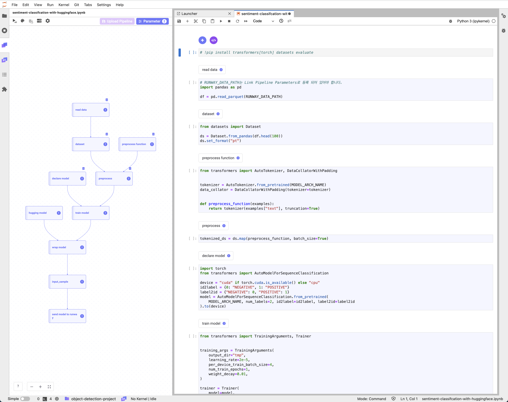
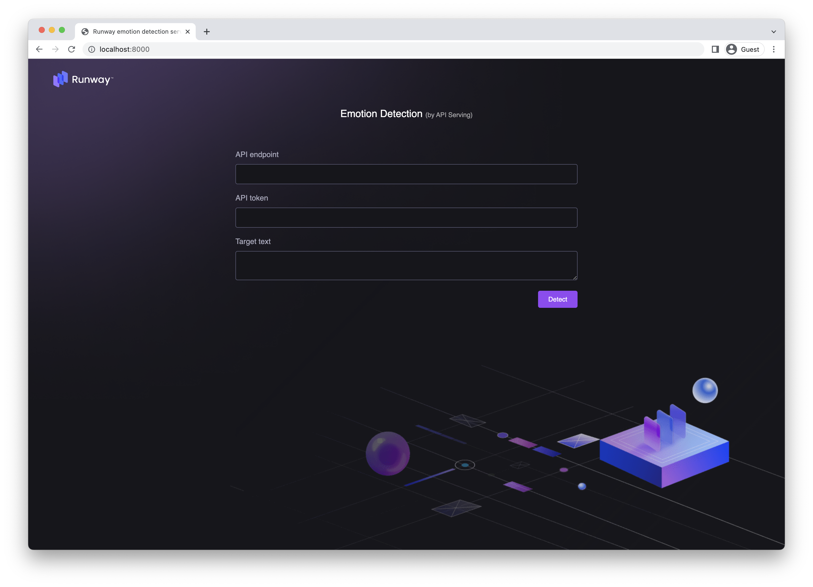
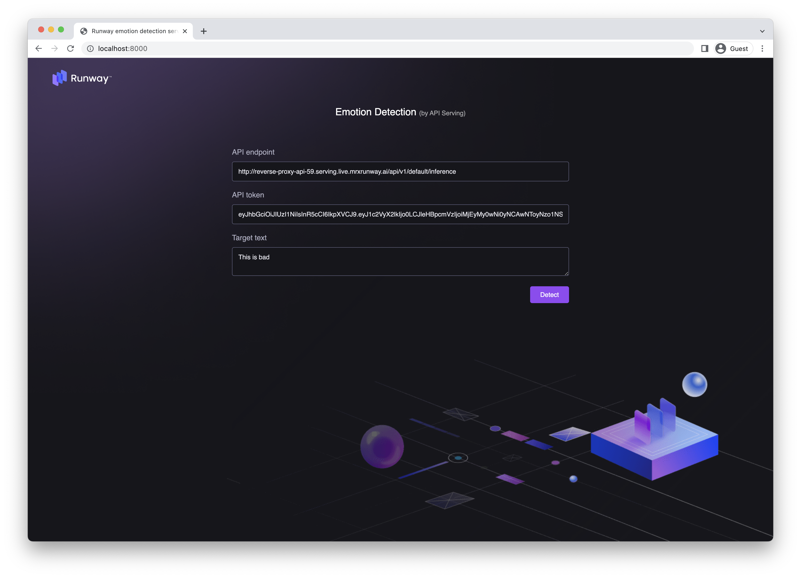

# Sentiment Classification with Huggingface

<h4 align="center">
    <p>
        <a href="README.md">한국어</a> |
        <b>English</b>
    <p>
</h4>

<h3 align="center">
    <p>The MLOps platform to Let your AI run</p>
</h3>

## Introduction

We use the Link included in Runway to train and save a Huggingface model.  
We also set up and save a pipeline to reuse the written model training code for future retraining.

> 📘 For quick execution, you can utilize the following Jupyter Notebook.  
> If you download and execute the Jupyter Notebook below, a model named "my-text-model" will be created and saved in Runway.
>
> **[sentiment classification with huggingface](https://drive.google.com/uc?export=download&id=1lbONDH69PuaJXrlxed3P6UlCfLAWaoqo)**



## Runway

> 📘 This tutorial uses the IMDB dataset provided by Stanford University, which has been reprocessed and uploaded as part of the [huggingface dataset](https://huggingface.co/datasets/imdb/tree/refs%2Fconvert%2Fparquet/plain_text). With this dataset, you can perform sentiment analysis.
>
> You can download the imdb dataset by clicking the link below.
> **[IMDB test dataset](https://drive.google.com/uc?export=download&id=1QlIzPfOw_b0xXnXM6rxnW3Vbr-VDm0At)**

### Create a dataset

> 📘 For detailed information on dataset creation, please refer to the [official documentation](https://docs.live.mrxrunway.ai/en/Guide/ml_development/datasets/dataset-runway/).

1. Navigate to the dataset page from the Runway project menu.
2. Access the dataset creation menu in the dataset menu.
    - Click the `+` button at the top of the left dataset list.
    - Click the `Create` button on the initial screen.
3. In the dialog, enter the name of the dataset to create and click the `Create` button.

### Creating Dataset Version

1.  Click the `Create version` button in the `Versions` section.
2.  Select `Local file` in the dialog.
3.  Enter the name and description of the dataset to be saved.
4.  Select the file to be created as a dataset using the file explorer or Drag&Drop.
5.  Click `Create`.

## Link

### Package Preparation

1. Install the required packages for the tutorial.

    ```python
    !pip install transformers[torch] datasets evaluate
    ```

### Data

#### Load Data

> 📘 You can find detailed instructions on how to load the dataset in the [Import Dataset](https://docs.live.mrxrunway.ai/en/Guide/ml_development/dev_instances/%EB%8D%B0%EC%9D%B4%ED%84%B0_%EC%84%B8%ED%8A%B8_%EA%B0%80%EC%A0%B8%EC%98%A4%EA%B8%B0/).

1. Click the **Add Runway Snippet** button at the top of the notebook cell.
2. Select **Import Dataset**.
3. Choose the version of the dataset you want to use and click **Save**.
4. Upon clicking the button, a snippet will be generated in the notebook cell allowing you to browse the files within the selected dataset. Additionally, a dataset parameter with the dataset path as its value will be added.
5. Utilize the name of the registered dataset parameter in the notebook cell where you want to load the dataset.
    ```python
    import os
    import pandas as pd

    dfs = []
    for dirname, _, filenames in os.walk(RUNWAY_DATA_PATH):
        for filename in filenames:
            if filename.endswith(".csv"):
                d = pd.read_csv(os.path.join(dirname, filename))
            elif filename.endswith(".parquet"):
                d = pd.read_parquet(os.path.join(dirname, filename))
            else:
                raise ValueError("Not valid file type")
            dfs += [d]
    df = pd.concat(dfs)
    ```

6. Create Huggingface Dataset with Pandas dataframe.

    ```python
    from datasets import Dataset

    ds = Dataset.from_pandas(df.sample(1000))
    ds.set_format("pt")
    ```

#### Data Preprocessing

> 📘 You can find guidance on registering Link parameters in the **[Set Pipeline Parameter](https://docs.live.mrxrunway.ai/en/Guide/ml_development/dev_instances/%ED%8C%8C%EC%9D%B4%ED%94%84%EB%9D%BC%EC%9D%B8_%ED%8C%8C%EB%9D%BC%EB%AF%B8%ED%84%B0_%EC%84%A4%EC%A0%95/)**.

1. To choose the architecture for the tokenizer, register `"distilbert-base-uncased"` in the `MODEL_ARCH_NAME` Link parameter.

    

2. Load the tokenizer and write the preprocessing code.

    ```python
    from transformers import AutoTokenizer, DataCollatorWithPadding


    tokenizer = AutoTokenizer.from_pretrained(MODEL_ARCH_NAME)
    data_collator = DataCollatorWithPadding(tokenizer=tokenizer)


    def preprocess_function(examples):
        return tokenizer(examples["text"], truncation=True)
    ```

3. Perform data preprocessing.

    ```python
    tokenized_ds = ds.map(preprocess_function, batch_size=True)
    ```

### Model Training

1. Use the Transformer's `AutoModelForSequenceClassification` module to load the model.

    ```python
    import torch
    from transformers import AutoModelForSequenceClassification

    device = "cuda" if torch.cuda.is_available() else "cpu"
    id2label = {0: "NEGATIVE", 1: "POSITIVE"}
    label2id = {"NEGATIVE": 0, "POSITIVE": 1}
    model = AutoModelForSequenceClassification.from_pretrained(
        MODEL_ARCH_NAME, num_labels=2, id2label=id2label, label2id=label2id
    ).to(device)
    ```

2. Use the loaded model and the training dataset to perform model training.

    ```python
    from transformers import TrainingArguments, Trainer


    train_params = {
        "learning_rate": 2e-5,
        "per_device_train_batch_size": 4,
        "num_train_epochs": 1,
        "weight_decay": 0.01,
    }

    training_args = TrainingArguments(
        output_dir="tmp",
        learning_rate=train_params["learning_rate"],
        per_device_train_batch_size=train_params["per_device_train_batch_size"],
        num_train_epochs=train_params["num_train_epochs"],
        weight_decay=train_params["weight_decay"],
    )

    trainer = Trainer(
        model=model,
        args=training_args,
        train_dataset=tokenized_ds,
        tokenizer=tokenizer,
        data_collator=data_collator,
    )

    trainer.train()
    ```

### Upload Model

#### Model Wrapping Class

1. Write the `HuggingModel` class to be used for API serving.

    ```python
    import pandas as pd


    class HuggingModel:
        def __init__(self, pipeline):
            self.pipeline = pipeline

        def predict(self, X):
            result = self.pipeline(X["text"].to_list())
            return pd.DataFrame.from_dict(result)
    ```

2. Create the Transformer pipeline and wrap it with the `HuggingModel`.

    ```python
    from transformers import pipeline


    model = model.to("cpu")
    pipe = pipeline("text-classification", model=model, tokenizer=tokenizer)

    hug_model = HuggingModel(pipe)
    ```

3. Evaluate the model

    ```python
    from sklearn.metrics import accuracy_score, roc_curve, roc_auc_score

    # validate

    valid_pred = hug_model.predict(valid)

    label = valid["label"]
    pred = valid_pred["label"].map(label2id)
    score = valid_pred["score"]

    acc_score = accuracy_score(label, pred)
    roc_score = roc_auc_score(label, score)
    ```

#### Upload Model

> 📘 You can find detailed instructions on how to save the model in the [Upload Model](https://docs.live.mrxrunway.ai/en/Guide/ml_development/dev_instances/%EB%AA%A8%EB%8D%B8_%EC%97%85%EB%A1%9C%EB%93%9C/).
1. Create a sample input data from the training dataset.

    ```python
    input_sample = df.sample(1).drop(columns=["label"])
    input_samples
    ```

2. Use the `save model` option from the Runway code snippet to save the model. Also, log the information that are related to the model.

    ```python
    import runway

    runway.start_run()
    runway.log_parameters(train_params)
    runway.log_parameter("MODEL_ARCH_NAME", MODEL_ARCH_NAME)
    runway.log_metric("accuracy_score", acc_score)
    runway.log_metric("roc_score", roc_score)

    runway.log_model(model_name="my-text-model", model=hug_model, input_samples={"predict": input_sample})

    ```

## Pipeline Configuration and Saving

> 📘 For specific guidance on creating a pipeline, refer to the [Upload Pipeline](https://docs.live.mrxrunway.ai/en/Guide/ml_development/dev_instances/%ED%8C%8C%EC%9D%B4%ED%94%84%EB%9D%BC%EC%9D%B8_%EC%97%85%EB%A1%9C%EB%93%9C/).

1.  Write and verify the pipeline in **Link** to ensure it runs smoothly.
2.  After verifying successful execution, click the **Upload pipeline** button in the Link pipeline panel.
3.  Click the **New Pipeline** button.
4.  Enter the name for the pipeline to be saved in Runway in the **Pipeline** field.
5.  The **Pipeline version** field will automatically select version 1.
6.  Click the **Upload** button.
7.  Once the upload is complete, the uploaded pipeline item will appear on the Pipeline page within the project.


## Model Deployment

> 📘 You can find specific guidance on model deployment in the **[Model Deployment](https://docs.live.mrxrunway.ai/en/Guide/ml_serving/model_deployments/%EB%AA%A8%EB%8D%B8_%EB%B0%B0%ED%8F%AC/)**.

## Demo Site

1. To test the deployed model, you can use the following [demo website](http://demo.service.mrxrunway.ai/emotion).
2. If you are in demo site you will see the following screen:

    

3. Input the API Endpoint, API Token received, and the sentence to predict.

    

4. You will receive the result.

    
