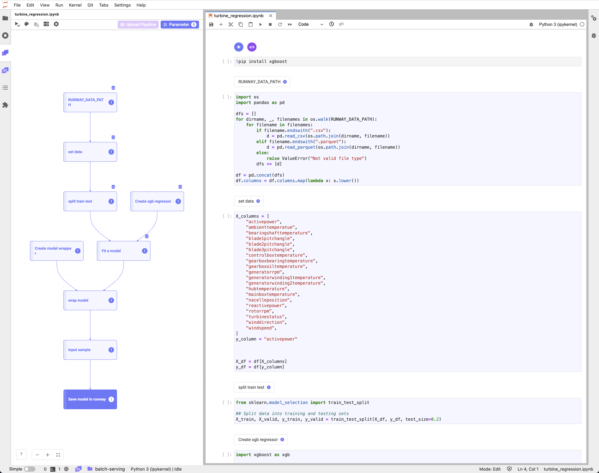
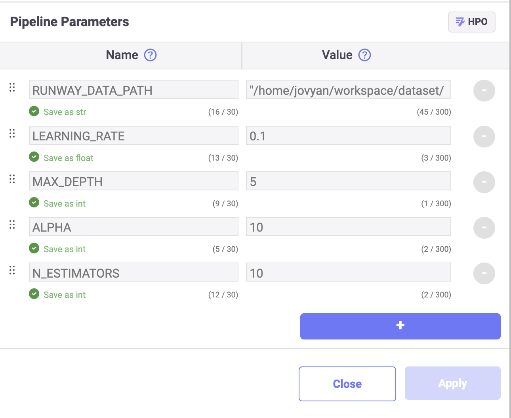

# XGBoost 기반 풍력 발전량 예측 (Wind Power Prediction with XGBoost)

<h4 align="center">
    <p>
        <b>한국어</b> |
        <a href="README_en.md">English</a>
    <p>
</h4>

<h3 align="center">
    <p>The MLOps platform to Let your AI run</p>
</h3>

## 소개

이 튜토리얼은 풍력 발전 터빈(Wind Turbine)에서 수집된 센서 로그 데이터를 이용해 풍력 발전량을 예측하는 XGBoost 모델을 학습하여 저장합니다. ([Wind Power Forecasting](https://www.kaggle.com/datasets/theforcecoder/wind-power-forecasting) Kaggle 제공) 작성한 모델 학습 코드를 재학습에 활용하기 위해 파이프라인을 구성하고 저장합니다.

> 📘 빠른 실행을 위해 아래의 주피터 노트북을 활용할 수 있습니다.  
> 아래의 주피터 노트북을 다운로드 받아 실행할 경우, "my-xgboost-regressor" 이름의 모델이 생성되어 Runway에 저장됩니다.
>
> **[wind_power_prediction_with_xgboost](https://drive.google.com/uc?export=download&id=16ruQV9Q4sJuxvN7IxrPjTqHSv5gNducc)**



### 패키지 설치

1. 튜토리얼에서 사용할 패키지를 설치합니다.
    ```python
    !pip install xgboost
    ```

## 데이터


Runway 튜토리얼 폴더에 포함된 CSV 파일을 불러와 데이터 세트를 생성하고, 전처리합니다.

> 📘 이 튜토리얼은 Kaggle 에서 제공하는 [Wind Power Forecasting](https://www.kaggle.com/datasets/theforcecoder/wind-power-forecasting)에 포함된 데이터를 사용합니다.
> 풍력 발전에 대한 데이터 세트는 `./dataset` 경로에 위치하고 있으며, 필요할 경우 아래 링크를 통해 데이터를 다운로드할 수 있습니다.
> **[Wind power forecasting dataset](https://drive.google.com/uc?export=download&id=16iE44jF7J6rCa01EGcUP1wuMrKJUdN7J)**

### 데이터 불러오기

1. 파일 탐색기에서 데이터 세트 파일의 경로를 확인합니다.
2. RUNWAY_DATA_PATH 파라미터에 데이터 파일의 경로를 할당합니다.
   
    ```python
    import os
    import pandas as pd

    RUNWAY_DATA_PATH = "/home/jovyan/workspace/examples/tutorial/wind_power_prediction_with_xgboost/dataset"
    dfs = []
    for dirname, _, filenames in os.walk(RUNWAY_DATA_PATH):
        for filename in filenames:
            if filename.endswith(".csv"):
                d = pd.read_csv(os.path.join(dirname, filename))
            elif filename.endswith(".parquet"):
                d = pd.read_parquet(os.path.join(dirname, filename))
            else:
                raise ValueError("Not valid file type")
            dfs += [d]

    df = pd.concat(dfs)
    df.columns = df.columns.map(lambda x: x.lower())
    ```

### 데이터 전처리

1. 데이터를 X, y 로 나눕니다.
    ```python
    X_columns = [
        "ambienttemperatue",
        "bearingshafttemperature",
        "blade1pitchangle",
        "blade2pitchangle",
        "blade3pitchangle",
        "controlboxtemperature",
        "gearboxbearingtemperature",
        "gearboxoiltemperature",
        "generatorrpm",
        "generatorwinding1temperature",
        "generatorwinding2temperature",
        "hubtemperature",
        "mainboxtemperature",
        "nacelleposition",
        "reactivepower",
        "rotorrpm",
        "turbinestatus",
        "winddirection",
        "windspeed",
    ]
    y_column = "activepower"


    X_df = df[X_columns]
    y_df = df[y_column]
    ```

2. 학습 데이터와 평가 데이터를 나눕니다.
    ```python
    from sklearn.model_selection import train_test_split

    ## Split data into training and testing sets
    X_train, X_valid, y_train, y_valid = train_test_split(X_df, y_df, test_size=0.2, random_state=2024)
    ```

## 모델
### 모델 학습

> 📘 Link 파라미터 등록 가이드는 **[파이프라인 파라미터](https://docs.live.mrxrunway.ai/guide/core-features/dev-instances/set-pipeline-parameters/)** 문서에서 확인할 수 있습니다.

1. XGBRegressor에서 사용할 컴포넌트의 개수를 지정하기 위해서 Link 파라미터로 다음 항목들을 등록합니다.
    - `LEARNING_RATE`: 0.1
    - `MAX_DEPTH`: 5
    - `ALPHA`: 10
    - `N_ESTIMATORS`: 10

    

2. XGBoost의 `XGBRegressor` 모듈을 이용해 모델을 불러옵니다.
    ```python
    import xgboost as xgb
    from sklearn.metrics import mean_absolute_error, mean_squared_error


    params = {
       "objective": "reg:squarederror",
       "learning_rate": LEARNING_RATE,
       "max_depth": MAX_DEPTH,
       "alpha": ALPHA,
       "n_estimators": N_ESTIMATORS,
       }

    regr = xgb.XGBRegressor(
       objective=params["objective"],
       learning_rate=params["learning_rate"],
       max_depth=params["max_depth"],
       alpha=params["alpha"],
       n_estimators=params["n_estimators"],
    )
    ```

3. 불러온 모델과 학습용 데이터 세트를 활용하여, 모델 학습을 수행하고 평가 데이터로 평가합니다.
    ```python
    regr.fit(X_train, y_train, eval_set=[(X_valid, y_valid)])

    y_pred = regr.predict(X_valid)
    mae = mean_absolute_error(y_pred, y_valid)
    mse = mean_squared_error(y_pred, y_valid)
    mse
    ```

### 모델 랩핑 클래스

1. API 서빙에 이용할 수 있도록 `RunwayModel` 클래스를 작성합니다.
    ```python
    import mlflow
    import pandas as pd


    class RunwayModel(mlflow.pyfunc.PythonModel):
        def __init__(self, xgb_regressor):
            self._regr = xgb_regressor

        def predict(self, context, X):
            pred = self._regr.predict(X)
            activepower_pred = {"activepower": pred}
            pred_df = pd.DataFrame(activepower_pred)
            return pred_df
    ```

### 모델 등록

학습이 완료된 회귀 모델을 Runway에 등록하여 추론 서비스에서 사용할 수 있도록 합니다.

1. Runway 플랫폼의 모델 등록 코드 스니펫을 사용하여, 학습이 완료된 모델을 등록(`log_model`)하고 관련 정보를 기록합니다.
    ```python
    import mlflow
    import runway

    with mlflow.start_run():
        runway_model = RunwayModel(regr)
        input_df = df[X_columns]
        input_sample = input_df.sample(1)

        mlflow.log_params(params)
        mlflow.log_metric("valid_mae", mae)
        mlflow.log_metric("valid_mse", mse)

        runway.log_model(
            model=runway_model,
            model_name="my-xgboost-regressor",
            input_samples={"predict": input_sample},
        )
    ```

## 파이프라인 구성 및 저장

> 📘 파이프라인 생성 방법에 대한 구체적인 가이드는 **[파이프라인 구성](https://docs.live.mrxrunway.ai/guide/core-features/dev-instances/create-a-pipeline/)** 문서에서 확인할 수 있습니다.

1. **Link**에서 파이프라인을 작성하고 정상 실행 여부를 확인합니다.
2. 정상 실행 확인 후, Link pipeline 패널의 **Upload pipeline** 버튼을 클릭합니다.
3. **New Pipeline** 버튼을 클릭합니다.
4. **Pipeline** 필드에 Runway에 저장할 이름을 작성합니다.
5. **Pipeline version** 필드에는 자동으로 버전 1이 선택됩니다.
6. **Upload** 버튼을 클릭합니다.
7. 업로드가 완료되면 프로젝트 내 Pipeline 페이지에 업로드한 파이프라인 항목이 표시됩니다.
