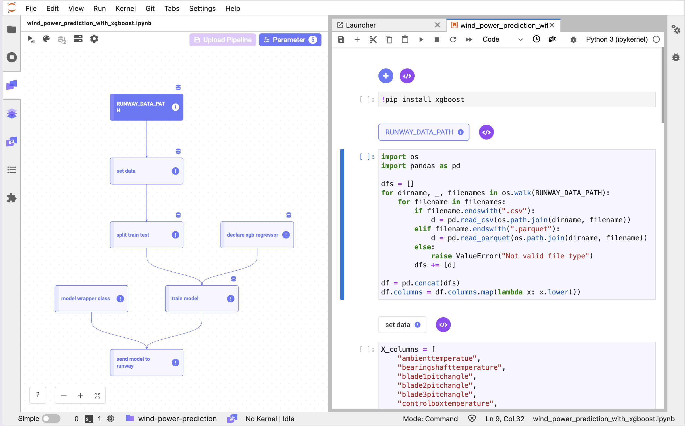

# Wind Power Prediction with XGBoost

<h4 align="center">
    <p>
        <a href="README.md">한국어</a> |
        <b>English</b>
    <p>
</h4>

<h3 align="center">
    <p>The MLOps platform to Let your AI run</p>
</h3>

## Introduction

rain and save an XGBoost model using the links included in the Runway.  
Construct and save a pipeline for reusing the written model training code for retraining

> 📘 For quick execution, you can utilize the following Jupyter Notebook.  
> If you download and execute the Jupyter Notebook below, a model named ""my-xgboost-regressor" will be created and saved in Runway.
>
> **[wind_power_prediction_with_xgboost](https://drive.google.com/uc?export=download&id=16ruQV9Q4sJuxvN7IxrPjTqHSv5gNducc)**



## Runway

> 📘 This tutorial use dataset [Wind Power Forecasting](https://www.kaggle.com/datasets/theforcecoder/wind-power-forecasting) from Kaggle. Using this dataset we can predict generate power prediction.
>
> Wind power forecasting dataset can download from below link.
> **[Wind power forecasting dataset](https://drive.google.com/uc?export=download&id=16iE44jF7J6rCa01EGcUP1wuMrKJUdN7J)**


### Create a dataset

> 📘 For detailed information on dataset creation, please refer to the [official documentation](https://docs.live.mrxrunway.ai/en/Guide/ml_development/datasets/dataset-runway/).

1. Navigate to the dataset page from the Runway project menu.
2. Access the dataset creation menu in the dataset menu.
    - Click the `+` button at the top of the left dataset list.
    - Click the `Create` button on the initial screen.
3. In the dialog, enter the name of the dataset to create and click the `Create` button.

### Creating Dataset Version

1.  Click the `Create version` button in the `Versions` section.
2.  Select `Local file` in the dialog.
3.  Enter the name and description of the dataset to be saved.
4.  Select the file to be created as a dataset using the file explorer or Drag&Drop.
5.  Click `Create`.

## Link

### Install package

1. Install the required packages for the tutorial.
    ```python
    !pip install xgboost
    ```

### Data

#### Load data

> 📘 You can find detailed instructions on how to load the dataset in the [Import Dataset](https://docs.live.mrxrunway.ai/en/Guide/ml_development/dev_instances/%EB%8D%B0%EC%9D%B4%ED%84%B0_%EC%84%B8%ED%8A%B8_%EA%B0%80%EC%A0%B8%EC%98%A4%EA%B8%B0/).

1. Click the **Add Runway Snippet** button at the top of the notebook cell.
2. Select **Import Dataset**.
3. Choose the version of the dataset you want to use and click **Save**.
4. Upon clicking the button, a snippet will be generated in the notebook cell allowing you to browse the files within the selected dataset. Additionally, a dataset parameter with the dataset path as its value will be added.
5. Utilize the name of the registered dataset parameter in the notebook cell where you want to load the dataset.
    ```python
    import os
    import pandas as pd

    dfs = []
    for dirname, _, filenames in os.walk(RUNWAY_DATA_PATH):
        for filename in filenames:
            if filename.endswith(".csv"):
                d = pd.read_csv(os.path.join(dirname, filename))
            elif filename.endswith(".parquet"):
                d = pd.read_parquet(os.path.join(dirname, filename))
            else:
                raise ValueError("Not valid file type")
            dfs += [d]
    df = pd.concat(dfs)
    ```

#### Preprocess data

1. Split data to X, y.
    ```python
    X_columns = [
        "ambienttemperatue",
        "bearingshafttemperature",
        "blade1pitchangle",
        "blade2pitchangle",
        "blade3pitchangle",
        "controlboxtemperature",
        "gearboxbearingtemperature",
        "gearboxoiltemperature",
        "generatorrpm",
        "generatorwinding1temperature",
        "generatorwinding2temperature",
        "hubtemperature",
        "mainboxtemperature",
        "nacelleposition",
        "reactivepower",
        "rotorrpm",
        "turbinestatus",
        "winddirection",
        "windspeed",
    ]
    y_column = "activepower"


    X_df = df[X_columns]
    y_df = df[y_column]
    ```

2. Split data to train and valid.
    ```python
    from sklearn.model_selection import train_test_split

    ## Split data into training and testing sets
    X_train, X_valid, y_train, y_valid = train_test_split(X_df, y_df, test_size=0.2, random_state=2024)
    ```

### Train model

> 📘 You can find guidance on registering Link parameters in the **[Set Pipeline Parameter](https://docs.live.mrxrunway.ai/en/Guide/ml_development/dev_instances/%ED%8C%8C%EC%9D%B4%ED%94%84%EB%9D%BC%EC%9D%B8_%ED%8C%8C%EB%9D%BC%EB%AF%B8%ED%84%B0_%EC%84%A4%EC%A0%95/)**.

1. To specify the number of components to use in XGBRegressor, you register the following items with the Link parameter.

    - `LEARNING_RATE`: 0.1
    - `MAX_DEPTH`: 5
    - `ALPHA`: 10
    - `N_ESTIMATORS`: 10

    

2. Load the model using the `XGBRegressor` module of XGBoost.
    ```python
    import xgboost as xgb
    from sklearn.metrics import mean_absolute_error, mean_squared_error


    params = {
       "objective": "reg:squarederror",
       "learning_rate": LEARNING_RATE,
       "max_depth": MAX_DEPTH,
       "alpha": ALPHA,
       "n_estimators": N_ESTIMATORS,
       }

    regr = xgb.XGBRegressor(
       objective=params["objective"],
       learning_rate=params["learning_rate"],
       max_depth=params["max_depth"],
       alpha=params["alpha"],
       n_estimators=params["n_estimators"],
    )
    ```

3. Use the loaded model and the training dataset to perform model training and evaluate it with the evaluation data.
    ```python
    regr.fit(X_train, y_train, eval_set=[(X_valid, y_valid)])

    y_pred = regr.predict(X_valid)
    mae = mean_absolute_error(y_pred, y_valid)
    mse = mean_squared_error(y_pred, y_valid)
    ```


### Upload model

#### Model wrapping class

1. Write the `RunwayModel` class to be used for API serving.
    ```python
    import pandas as pd


    class RunwayModel:
        def __init__(self, xgb_regressor):
            self._regr = xgb_regressor

        def predict(self, X):
            df, uuid = X.drop(columns=["uuid"]), X[["uuid"]].reset_index(drop=True)
            uuid = uuid.rename(columns={"uuid": "pred_uuid"})
            pred = self._regr.predict(df)
            activepower_pred = {"activepower": pred}
            pred_df = pd.DataFrame(activepower_pred)
            return pd.concat([pred_df, uuid], axis=1)
    ```


#### Upload model

> 📘 You can find detailed instructions on how to save the model in the [Upload Model](https://docs.live.mrxrunway.ai/en/Guide/ml_development/dev_instances/%EB%AA%A8%EB%8D%B8_%EC%97%85%EB%A1%9C%EB%93%9C/).

1. Use the "save model" option from the Runway code snippet to save the model.
2. Wrap fitted `regr` with `RunwayModel`.
3. Create a sample input data for the generated code.
4. Log metric and parameters for uploading model.
    ```python
    import runway

    runway_model = RunwayModel(regr)

    input_columns = X_columns + ["uuid"]
    input_df = df[input_columns]
    input_sample = input_df.sample(1)


    runway.start_run()
    runway.log_parameters(params)

    runway.log_metric("valid_mae", mae)
    runway.log_metric("valid_mse", mse)

    runway.log_model(model_name="my-xgboost-regressor", model=runway_model, input_samples={"predict": input_sample})

    runway.stop_run()
    ```

## Pipeline Configuration and Saving

> 📘 For specific guidance on creating a pipeline, refer to the [Upload Pipeline](https://docs.live.mrxrunway.ai/en/Guide/ml_development/dev_instances/%ED%8C%8C%EC%9D%B4%ED%94%84%EB%9D%BC%EC%9D%B8_%EC%97%85%EB%A1%9C%EB%93%9C/).

1.  Write and verify the pipeline in **Link** to ensure it runs smoothly.
2.  After verifying successful execution, click the **Upload pipeline** button in the Link pipeline panel.
3.  Click the **New Pipeline** button.
4.  Enter the name for the pipeline to be saved in Runway in the **Pipeline** field.
5.  The **Pipeline version** field will automatically select version 1.
6.  Click the **Upload** button.
7.  Once the upload is complete, the uploaded pipeline item will appear on the Pipeline page within the project.
