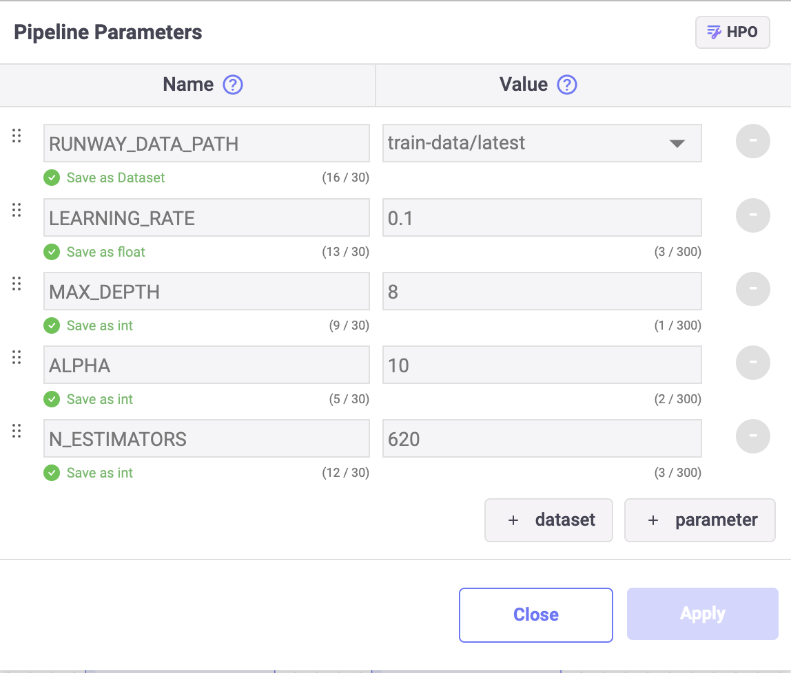

# Wind Power Prediction with XGBoost

<h4 align="center">
    <p>
        <a href="README.md">한국어</a> |
        <b>English</b>
    <p>
</h4>

<h3 align="center">
    <p>The MLOps platform to Let your AI run</p>
</h3>

## Introduction

Runway에 포함된 Link를 사용하여 XGBoost 모델을 학습하고 저장합니다.  
작성한 모델 학습 코드를 재학습에 활용하기 위해 파이프라인을 구성하고 저장합니다.

> 📘 For quick execution, you can utilize the following Jupyter Notebook.  
> If you download and execute the Jupyter Notebook below, a model named ""my-xgboost-regressor" will be created and saved in Runway.
>
> **[wind_power_prediction_with_xgboost](https://drive.google.com/uc?export=download&id=16ruQV9Q4sJuxvN7IxrPjTqHSv5gNducc)**


## Runway

### create a dataset

> 📘 This tutorial use dataset [Wind Power Forecasting](https://www.kaggle.com/datasets/theforcecoder/wind-power-forecasting) from Kaggle. Using this dataset we can predict generate power prediction.
>
> Wind power forecasting dataset can download from below link.
> **[Wind power forecasting dataset](https://drive.google.com/uc?export=download&id=16iE44jF7J6rCa01EGcUP1wuMrKJUdN7J)**

1. Go to the Runway project menu and navigate to the dataset page.
2. Create a new dataset on the dataset page.
3. Click on the `Create Dataset` button in the top right corner.
4. Select `Local File` on `Tabular Data` area.
5. Provide a name and description for the dataset you are creating.
6. Choose the file to include in the dataset using the file explorer or drag-and-drop.
7. Click on `Create`.

## Link

### Install package

1. Install the required packages for the tutorial.

```python
!pip install xgboost
```

### Data

#### Load data

> 📘 You can find detailed instructions on how to load the dataset in the [Import Dataset](https://docs.mrxrunway.ai/v0.13.0-Eng/docs/import-dataset).

1. Use the Runway code snippet menu to import the list of datasets registered in your project.
2. Select the created dataset and generate code

    ```python
    import os
    import pandas as pd

    dfs = []
    for dirname, _, filenames in os.walk(RUNWAY_DATA_PATH):
        for filename in filenames:
            if filename.endswith(".csv"):
                d = pd.read_csv(os.path.join(dirname, filename))
            elif filename.endswith(".parquet"):
                d = pd.read_parquet(os.path.join(dirname, filename))
            else:
                raise ValueError("Not valid file type")
            dfs += [d]
    df = pd.concat(dfs)
    ```

#### Preprocess data

1. Split data to X, y.

    ```python
    X_columns = [
       "activepower",
       "ambienttemperatue",
       "bearingshafttemperature",
       "blade1pitchangle",
       "blade2pitchangle",
       "blade3pitchangle",
       "controlboxtemperature",
       "gearboxbearingtemperature",
       "gearboxoiltemperature",
       "generatorrpm",
       "generatorwinding1temperature",
       "generatorwinding2temperature",
       "hubtemperature",
       "mainboxtemperature",
       "nacelleposition",
       "reactivepower",
       "rotorrpm",
       "turbinestatus",
       "winddirection",
       "windspeed",
    ]
    y_column = "activepower"


    X_df = df[X_columns]
    y_df = df[y_column]
    ```

2. Split data to train and valid.

    ```python
    from sklearn.model_selection import train_test_split

    ## Split data into training and testing sets
    X_train, X_valid, y_train, y_valid = train_test_split(X_df, y_df, test_size=0.2)
    ```

### Train model

> 📘 You can find guidance on registering Link parameters in the **[Set Pipeline Parameter](https://docs.mrxrunway.ai/v0.13.0-Eng/docs/set-pipeline-parameter)**.

1. To specify the number of components to use in XGBRegressor, you register the following items with the Link parameter.

    - `LEARNING_RATE`: 0.1
    - `MAX_DEPTH`: 5
    - `ALPHA`: 10
    - `N_ESTIMATORS`: 10

    

2. Load the model using the `XGBRegressor` module of XGBoost.

    ```python
    import xgboost as xgb
    from sklearn.metrics import mean_absolute_error, mean_squared_error


    params = {
       "objective": "reg:squarederror",
       "learning_rate": LEARNING_RATE,
       "max_depth": MAX_DEPTH,
       "alpha": ALPHA,
       "n_estimators": N_ESTIMATORS,
       }

    regr = xgb.XGBRegressor(
       objective=params["objective"],
       learning_rate=params["learning_rate"],
       max_depth=params["max_depth"],
       alpha=params["alpha"],
       n_estimators=params["n_estimators"],
    )
    ```

3. Use the loaded model and the training dataset to perform model training and evaluate it with the evaluation data.

    ```python
    regr.fit(X_train, y_train, eval_set=[(X_valid, y_valid)])

    y_pred = regr.predict(X_valid)
    mae = mean_absolute_error(y_pred, y_valid)
    mse = mean_squared_error(y_pred, y_valid)
    ```

4. Save the trained model results.

    ```python
    import runway

    runway.start_run()
    runway.log_parameters(params)

    runway.log_metric("valid_mae", mae)
    runway.log_metric("valid_mse", mse)
    ```

### Upload model

#### Model wrapping class

1. Write the `RunwayModel` class to be used for API serving.

    ```python
    import pandas as pd

    class RunwayModel:
        def __init__(self, xgb_regressor):
            self._regr = xgb_regressor

        def predict(self, X):
            return pd.DataFrame(
                {
                    "activepower": self._regr.predict(X),
                }
            )
    ```


#### Upload model

> 📘 You can find detailed instructions on how to save the model in the [Upload Model](https://docs.mrxrunway.ai/v0.13.1-Eng/docs/upload-model).

1. Use the "save model" option from the Runway code snippet to save the model.
2. Wrap fitted `regr` with `RunwayModel`.
3. Create a sample input data for the generated code.

    ```python
    import runway

    runway_model = RunwayModel(regr)
    input_sample = X_df.sample(1)

    runway.log_model(model_name="my-xgboost-regressor", model=runway_model, input_samples={"predict": input_sample})

    runway.stop_run()
    ```

## Pipeline Configuration and Saving

> 📘 For specific guidance on creating a pipeline, refer to the [Create Pipeline](https://docs.mrxrunway.ai/v0.13.0-Eng/docs/create-pipeline).

1. Select the code cells to be included in the pipeline and configure them as components.
2. Once the pipeline is complete, run the entire pipeline to verify that it works correctly.
3. After confirming the pipeline's successful operation, save the pipeline in Runway.
    1. Click on "Upload Pipeline" in the left panel area.
    2. Choose the pipeline saving option:
        1. For new pipeline, select "New Pipeline."
        2. For updating an existing pipeline, select "Update Version"
    3. Provide the necessary information to save the pipeline.
4. Go back to Runway project page, and click Pipeline.
5. You can now access the saved pipeline in the Runway project menu under the Pipeline page.
